## 0. 引言

> 您是否厌倦了人类之间使用离散语言的低效交流？您是否希望学习更加抽象且高效的表达方式，或者渴望与计算机建立更加连续的沟通？本门课程将从自然语言中单词的最基本表示——词向量开始讲起，详细讲解当前 $ NLP$ ( $Natural Language Processing$, 自然语言处理) 的主流模型  $Transformer$，并教授如何使用目前最热门的 $NLP$ 模型托管平台 $Hugging Face$ 🤗。

>如果您觉得自己的语言表达过于离散，希望学习具有连续性的表达方式；或者认为自己的表达过于直白，缺乏高层次的抽象；或者希望在本地部署类 $ChatGPT$ 语言模型，那么请将本课程压入您的运行栈。本课程虽无益于提升您作为人的表达能力，即教会您个人使用词向量表达并对高层次抽象语义特征进行提取，但可以使您的模型具有更加完备的自然语言理解与自然语言生成能力，从而在语言类任务中实现对您的代替。 在本课程中，您（或者您的模型，如果比您更智能的话）可以： 学习变形金刚的基本原理、结构，亲手组装并运行您的第一个变形金刚（模块无需自备）。了解大规模预训练语言模型的预训练、微调方法。 熟练掌握抱抱脸的使用场景与技巧。 对预训练语言模型进行微调，完成简单的文本任务。在学习完计算机视觉课程后，尝试使用多模态模型完成文本 & 图像任务。

## 1. 如何表示一个词的含义？

- 用一个 $id$ 表示一个词？

- 离散的 $id$ 型词语如何输入到神经网络之中？
- 神经网络的输入对象通常是 $feature$ -> 我们需要得到词的 $feature$xw
xw
### 🤗Word Embedding 词嵌入

- 将一个词映射为一个 $𝑒𝑚𝑏𝑒𝑑𝑑𝑖𝑛𝑔 \; dim$ 维的向量
- 每一维具有一定的含义（具体含义可能很抽象）

### 🤗如何获取 Word Embedding ？

- 手工构造？

  • “北京在北纬 $40$ 度，所以必须有一维向量的值是 $40$ ”？

- 通过在任务中拟合数据获得

  • 例如对于 $Next\;token\;prediction$ （根据前缀预测下个词）的任务：

  1. 随机初始化所有词 $v$ 的 $Word\; Embedding$ $E_v$
  2. 将前缀的 $Embedding$ 求和取平均 $E_{\text{predict}} = \frac{1}{k} \sum_{j=0}^{k-1} E_{v_j}$
  3. 下⼀个词是 $Embedding$ 与 $E_{predict}$ 最接近的词  $v_{\text{predict}} = \max_{v_i} \cos \left( E_{\text{predict}}, E_{v_i} \right)$
  4. 计算 $loss$，反向传播

## 2. 如何获取词在句子中的向量表示？

>An Apple a Day Keeps the Doctor Away 

>一天一部 Iphone 让我与博士学位失之交臂？

一个简单的想法：将句中所有词的向量加权求和，表示词在句中的含义。

### 🤗Skip-Gram & CBOW

一个词的意思取决于相邻词

### 🤗TextCNN

使用卷积来聚合特征

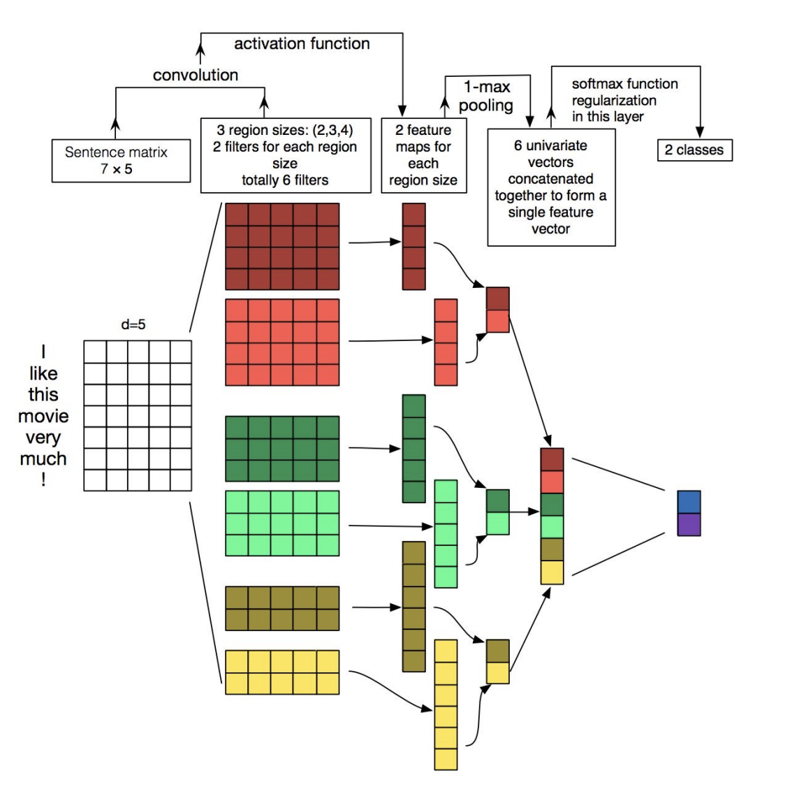

### 🤗RNN

预测下一个词

### 🤗长距离依赖？

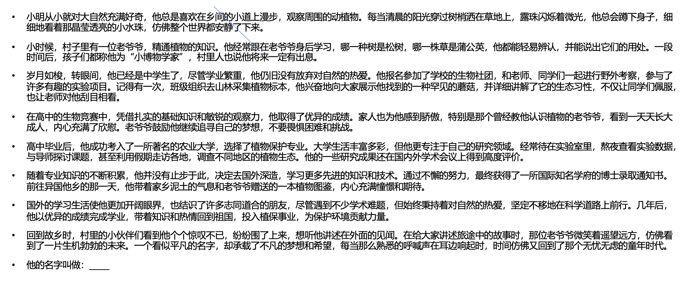

### 🤗Attention is all you need!

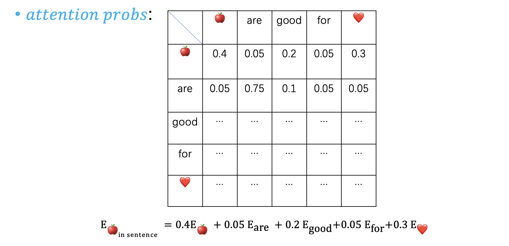

### 🤗Attention Probs

- 如何获取 $𝑎𝑡𝑡𝑒𝑛𝑡𝑖𝑜𝑛\;𝑝𝑟𝑜𝑏𝑠$？两个词越相关越大？

- 以两个词 $𝐸𝑚𝑏𝑒𝑑𝑑𝑖𝑛𝑔$ 的余弦夹角表示相似度：

$$\text{attention scores}(v_i, v_j) = \cos \left( E_{v_i}, E_{v_j} \right)$$

- 使用 $𝑆𝑜𝑓𝑡𝑚𝑎𝑥$ 归一化：

$$\text{attention probs}(v_i, v_j) = \frac{e^{\text{attention scores}(v_i, v_j)}}{\sum_{k=0}^{\text{sequence length}} e^{\text{attention scores}(v_i, v_k)}}$$

$$ E_{v_iin\;sentence}= \sum_{j=0}^{\text{seq\;len}} \text{attention probs}(v_i, v_j) E_j$$

### 🤗如何科学获取Attention Score？

- $𝐸𝑚𝑏𝑒𝑑𝑑𝑖𝑛𝑔$ 的余弦夹角：与 $𝑣_{i}$ 相似的特征真的是 $𝑣_{i}$ 需要的吗？🤔

  • 假如句子为：🍎🍎🍎🍎🍎🍎🍎🍎🍎🍎🍎are good.

  •与 $𝐸_{🍎}$ 最接近的总是 $𝐸_{🍎}$，$𝐸_{🍎in\;sentence}$= $𝐸_{🍎}$

- $𝐸𝑚𝑏𝑒𝑑𝑑𝑖𝑛𝑔 → (𝑄𝑢𝑒𝑟𝑦,𝐾𝑒𝑦)$ 🤗🤗🤗

- $𝑄𝑢𝑒𝑟𝑦$：想查询的特征

- $𝐾𝑒𝑦$：想被查询的特征

$$ 
\text{attention scores}(v_i, v_j) = \cos \left( E_{v_i}, E_{v_j} \right)
$$

### 🤔 Attention

$$
\text{Embedding}\xrightarrow{\text{Linear}} (\text{Query, Key, Value})
$$

$$ 
\text{attention scores}(v_i, v_j) = \cos \left( E_{v_i}, E_{v_j} \right)
$$

$$ \text{attention probs}(v_i, v_j) = \frac{e^{\text{attention scores}(v_i, v_j)}}{\sum_{k=0}^{\text{sequence length}} e^{\text{attention scores}(v_i, v_k)}}  $$

$$ V_{v_iin sentence}  = \sum_{j=0}^{\text{seq len}} \text{attention probs}(v_i, v_j) V_j$$

$$E_{v_iin sentence}   \xleftarrow{\text{Linear}} V_{v_iin sentence} $$

### 🤗 Attention

- $Query$: 我想找到他的名字… 

- $Key$: 

  • 小明 * 他的名字 = 0.8 

  • 他 * 他的名字 = 0.1 

  • 小博物学家 * 他的名字 = 0.05 

  • … 

- $Result$ = 0.8 * $V_{小明}$ + 0.1 * $V_{他}$ + 0.05 * $V_{小博物学家}$ + …

### 🤗 Attention

- $\text{Input: }  \text{Embeddings}_{\quad \text{shape} = (\text{seq len}, \text{embedding dim})}$
- $Q = Q_{\text{proj}}(\text{Embeddings})_{\quad \text{shape} = (\text{seq len}, \text{query dim})}$ 

- $K = K_{\text{proj}}(\text{Embeddings}) _{\quad \text{shape} = (\text{seq len}, \text{key dim}), \; \text{key dim} = \text{query dim}}$

- $V = V_{\text{proj}}(\text{Embeddings}) _{\quad \text{shape} = (\text{seq len}, \text{value dim}) }$

- $\text{Attention Probs}(Q, K) = \text{softmax}\left(\frac{QK^T}{\sqrt{\text{d}}}\right) _{\quad \text{shape} = (\text{seq len}, \text{seq len})}$

- $\text{Attention}(Q, K, V) = \text{softmax}\left(\frac{QK^T}{\sqrt{\text{d}}}\right) V _{\quad \text{shape} = (\text{seq len}, \text{value dim}) }\\$

- $\text{Output} = O_{\text{proj}}(\text{Attention}(Q, K, V)) _{\quad \text{shape} = (\text{seq len}, \text{embedding dim})}$
  

### 🤗如何加入位置信息🧭?

- $Attention$ 机制中，并没有考虑向量在 $sequence$​ 中的位置。

- $𝑃𝑜𝑠𝑖𝑡𝑖𝑜𝑛 𝑒𝑚𝑏𝑒𝑑𝑑𝑖𝑛𝑔$：为每一个位置预设一个向量 $𝑃𝐸_{pos}$​

  $$E_{v_iinput} = E_{v_i} + PE_{pos}$$

## 3. 如何在模型中存储知识？

### 🤗模型中知识存在何处？

- 知识：$Key-Value Pair:  (K, V)$

- $Neural Memory$，使用 $x$  查询 $k_i$：

$$p(k_i|x) \propto e^{k_i x}$$

$$MN(x) = \sum_{i=1}^{\text{dim}} p(k_i|x) \cdot v_i$$

$$K = [k_i], V = [v_i]$$

$$MN(x) = \text{softmax}(xK^T)V$$

- 用两个线性层实现前馈神经网络：

  $$FFN(x) = f(xK^T)V$$

### 🤗 Feedforward Neural Network

$$FFN(x) = f(xK^T)V$$

- $𝑓$ 一般使用 $𝑟𝑒𝑙𝑢$ 或其变种
- 一般 $inner\;ℎ𝑖𝑑𝑑𝑒𝑛 \;dim$ = $4\;𝑒𝑚𝑏𝑒𝑑𝑑𝑖𝑛𝑔\;dim$
- 参数量：$8×𝑒𝑚𝑏𝑒𝑑𝑑𝑖𝑛𝑔𝑠\;dim^2$

### 🤗 Transformer

- 从 $Input$ 序列到 $Output$ 序列——$Seq2Seq$

## 4. 如何基于以上原理构建语言模型？

- 语言模型：$P_\theta (\text{w|context})$

- $𝑐𝑜𝑛𝑡𝑒𝑥𝑡$：上下文

- $w$：某个位置上的某个词的概率

- 自编码语言模型（如 $BERT$）：

  • “北京在北纬$[MASK]$度”，求$[MASK]$填词的概率分布：𝑃(•|北京在北纬$[MASK]$度) 

- 自编码语言模型（如 $GPT$）: 

  • “北京在北”，求下一个字的概率分布：𝑃(•|北京在北)

### 🤗 Encoder Only

- 从 $Input$ 序列到分类输出—— $Classification$
- 典型模型：$BERT$

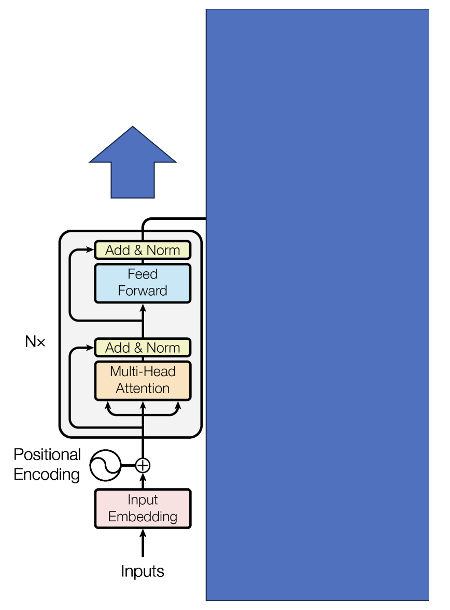

### 🤗 Decoder Only

- 从输入序列到输入序列的延长—— $Generation $
- 典型模型：$GPT$

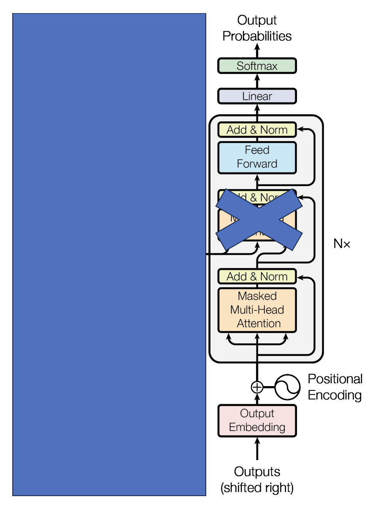

### 🤗 Attention Types

- $Self Attention$: $QKV$ 来自同一序列

- $Cross Attention$: $QKV$ 来自不同序列
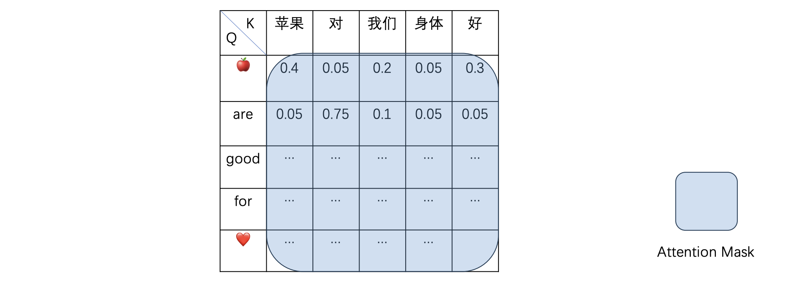

- 一种特殊的 $Self Attention$

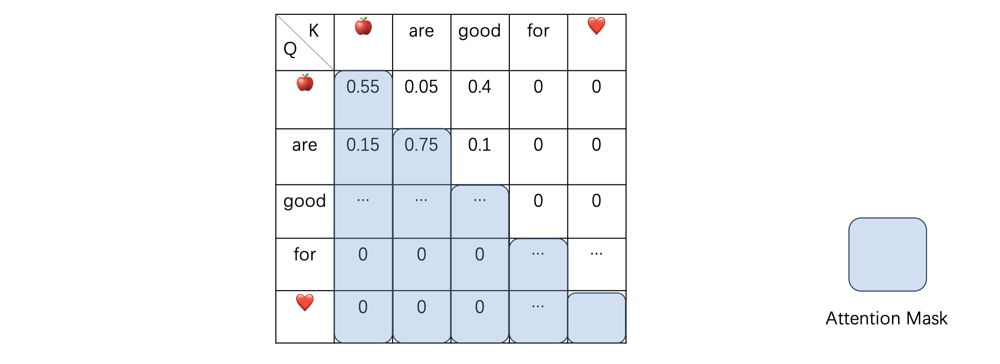

### 🤗 Multi Head Attention 🙂🙂🙂

- $\ (Q_0, Q_1, Q_2, Q_3) = Q = Q_{\text{proj}}(\text{Embeddings}) \quad Q_i.\ \text{shape} = (\text{seq len}, \frac{\text{embeddings dim}}{\text{num head}}) \\$​
- $\ (K_0, K_1, K_2, K_3) = K = K_{\text{proj}}(\text{Embeddings}) \quad K_i.\ \text{shape} = (\text{seq len}, \frac{\text{embeddings dim}}{\text{num head}}) $​
- $\ (V_0, V_1, V_2, V_3) = V = V_{\text{proj}}(\text{Embeddings}) \quad V_i.\ \text{shape} = (\text{seq len}, \frac{\text{embeddings dim}}{\text{num head}})$​

- $\text{Output} = O_{\text{proj}}(\text{Concat}(\text{Attention}(Q_i, K_i, V_i)))$​

- 参数量：$\ 4 \times \text{embeddings dim}^2$​
- 不同 $Head$ 关注不同的语义关系

### 🤗 Group Query Attention

### 🤗 Transformer

- $LM Head$：一个线性层，输入维度为 $embedding dim$；输出维度为词表大小 $vocab\;size$。
- 输出每个位置上各词未归一化的对数概率 logits: 
$$
P_\theta (\cdot \mid \text{context}) = \text{softmax}(\text{logits})
$$
- 左侧为 $Encoder$
- 右侧为 $Decoder$

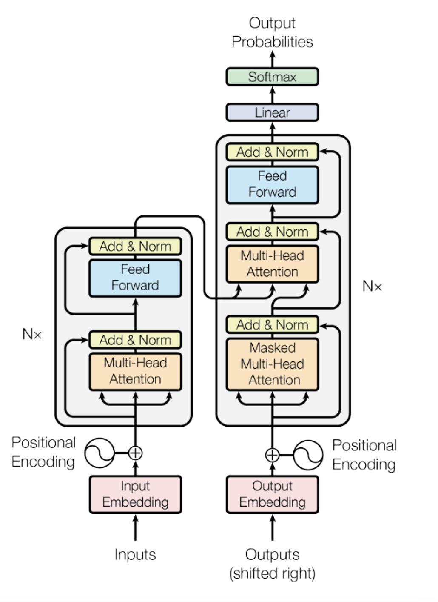

### 🤗 Encoder

- $BERT$
- 一次前向传播即可计算出所有$[MASK]$的概率分布
- 文本理解任务

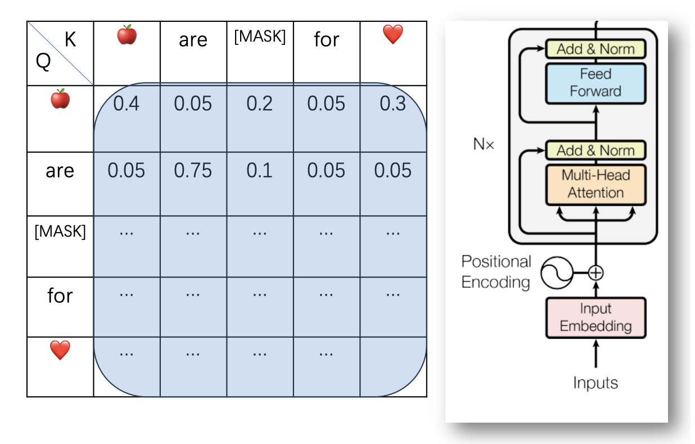

### 🤗 Decoder

- $GPT$
- 自回归生成：每次生成下一个词
- $Masked Attention$：每个词做$Attention$时只能加权到之前的词
- 文本生成任务

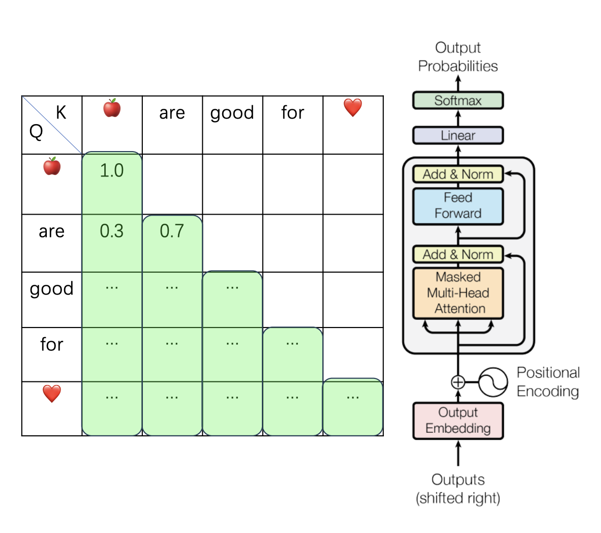

### 🤗如何训练语言模型？

- 随机初始化权重𝜃 

- 反复随机初始化权重𝜃，直到权重能较好地完成任务❌ 

- 使用大量人工标注文本对模型进行训练😧😧😧 

- 使用大量无标注文本对模型进行训练🧐😉🤗

### 🤗预训练

- $Mask filling or Next token prediction?$

- $Mask filling$:

  • 我是$[MASK]$，$[MASK]$考试没有一次$[MASK]$。

$$\max_\theta \left( P_\theta (\text{大学生|context}) \cdot P_\theta (\text{幼儿园|context} \cdot P_\theta (\text{参加|context}) \right)$$

- $Next token prediction$:

  • 我是大学生，

$$\max_\theta \left( \prod P_\theta (\text{next token} \mid \text{prefix}) \right)
  = \max_\theta \left( P_\theta (\text{大学生|我是}) \cdot P_\theta (\text{, |我是大学生}) \right)
$$

### 🤗如何使用语言模型完成具体下游任务？

- 反复随机初始化权重𝜃，直到权重𝜃能较好地完成任务❌ 
- 在预训练模型的基础上继续使用大量无标注文本训练😟 
- 使用少量标注数据 $(𝑥,𝑦)$ 模型进行训练🤗🤗🤗

#### 例：分类任务

- 替换预训练模型中的 $LM Head$ 为 $Classification Head $

- $Classification Head$ 输入维度为 $embedding\,dim$

- 输出维度为类别数目 $num\,labels$

- ~~然后直接拿去部署~~

  

- 使用标注的数据 $(𝑥,𝑦)$ 进行训练

  • $x$:文本；$y$:类别

### 🤗如何使用有限的硬件资源进行微调？

- $LoRA: Low-Rank Adaptation$

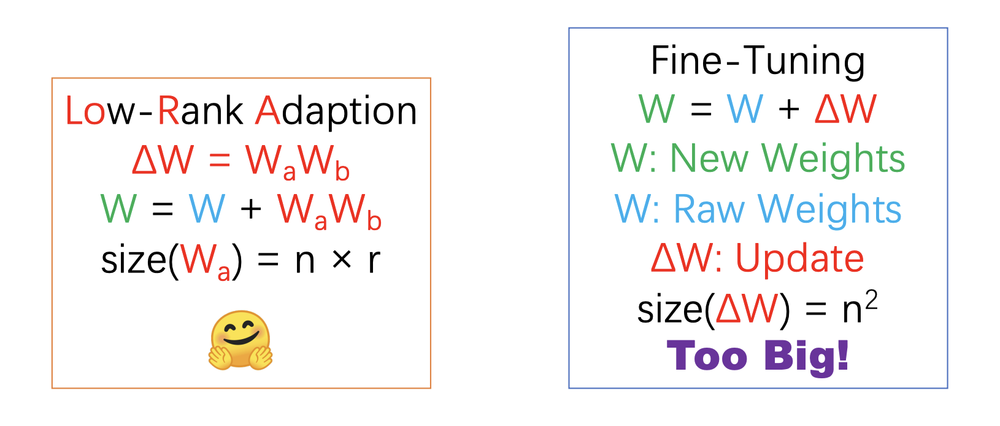

### 🤗如何让语言模型更好的理解人类意图？

- 指令微调
- 使用人工标注的 ($prompt, response$) 对模型进行微调
- 强化学习

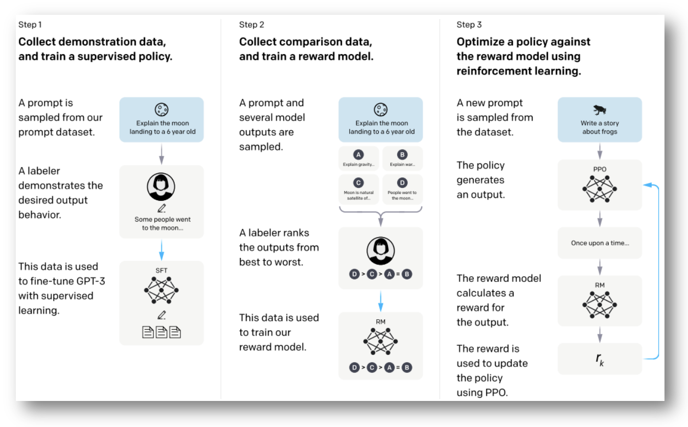