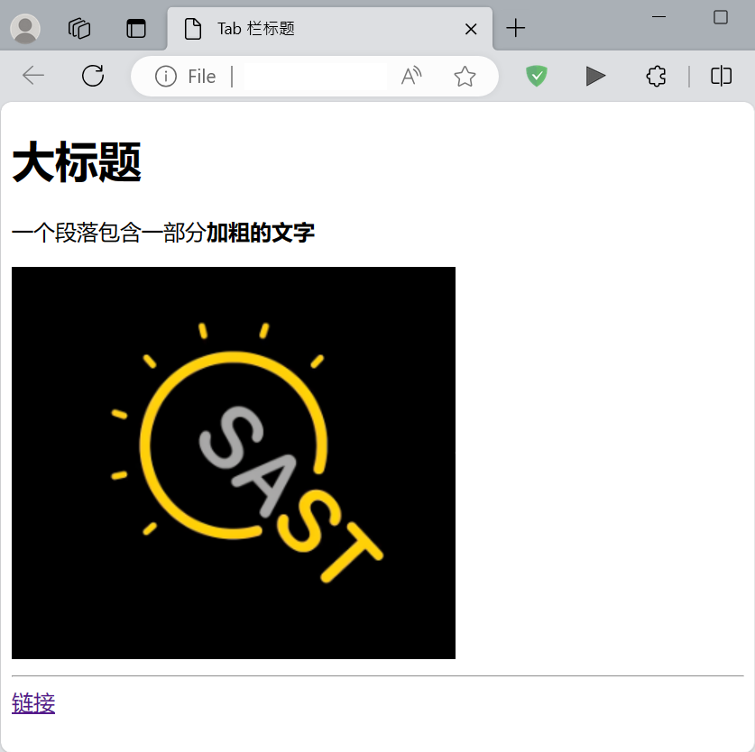
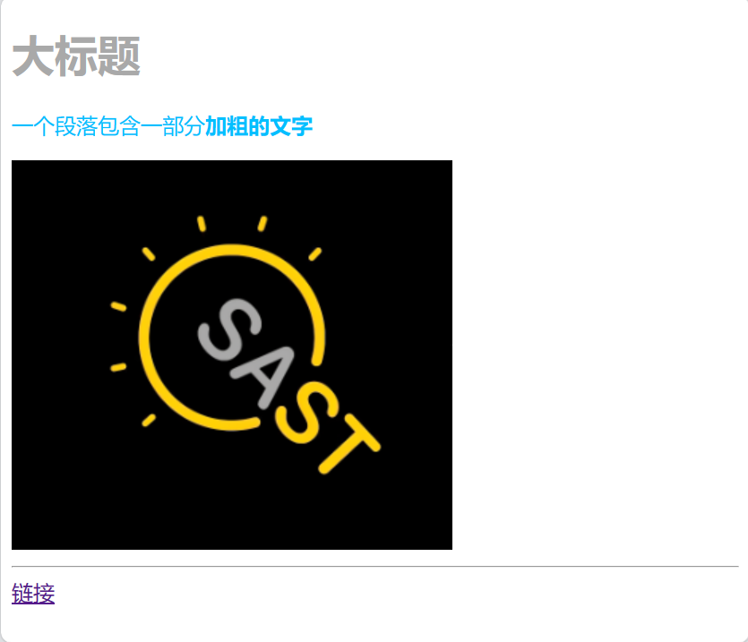
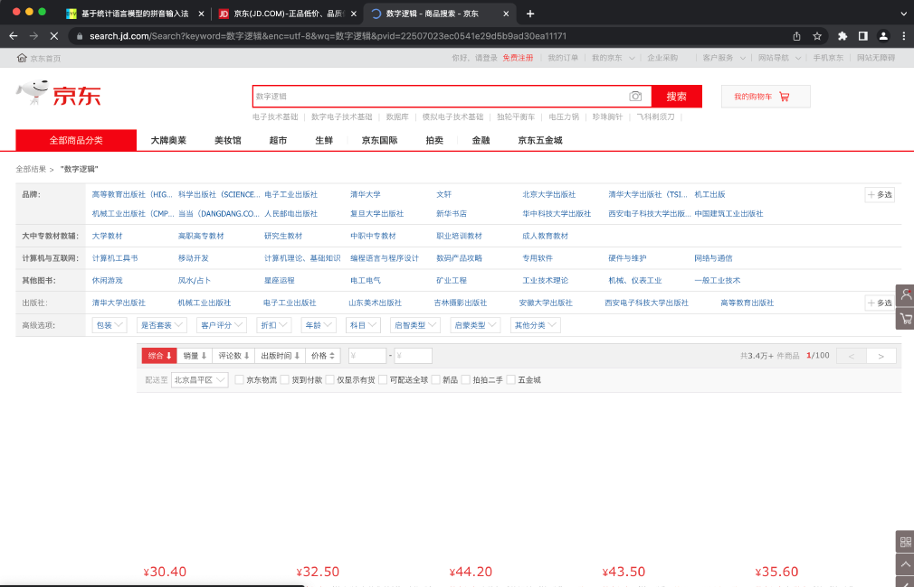

# Web 与 Web 应用基础

## 前言

当我们访问网站的时候，发生了些什么？网页实质上是文件。当我们通过浏览器访问网站时，浏览器会向服务器发送请求，服务器会将网页文件发送给浏览器，浏览器再将网页文件渲染成我们看到的网页。

## Web 页面

### HTML

HTML (Hyper Text Markup Language, 超文本标记语言) 是一种用于描述网页文档的语言。HTML 定义了许多不同种类的标签, 它们被尖括号包围，起始标签和结束标签通常成对出现，标签自身则表示了内容的类型与格式,标签内含有具体的内容。例如，下面的代码表示 **加粗的** “你好”

```html
<b>你好</b>
```

在 Word 中，我们通过手动在 Tab 栏里调整格式，文本的写作、结构和格式的调整相分离。而在 HTML 中，**内容的格式信息以标签的形式，作为纯文本存储在文件中**，便于生成、编辑、传输、渲染。

下面是一些常见的用来表征文本的 HTML 标签：

|标签|描述|
|---|---|
|`<h1>` - `<h6>`|定义标题，从最高级别到最低级别|
|`<p>`|定义段落|
|`<ul>`|定义无序列表|
|`<ol>`|定义有序列表|
|`<li>`|定义列表项|
|`<table>`|定义表格|
|`<tr>`|定义表格的行|
|`<td>`|定义表格的单元格|
|`<th>`|定义表格的表头单元格|
|`<strong>`|定义加粗的文本|
|`<em>`|定义斜体的文本|
|`<br>`|插入换行符|

作为“超文本标记语言”，HTML 标签还可以表征文本以外的内容，如图片、视频、超链接等能够在网页上显示的内容。此外，一些不在网页直接显示，但与网页有关的内容也可以用对应的标签在 HTML 中呈现。下面是另一些常用的标签：

|标签|描述|
|---|---|
|`<html>`|定义HTML文档的根元素|
|`<head>`|定义文档的头部区域|
|`<body>`|定义文档的主体区域|
|``|插入图像|
|`<a>`|创建链接|
|`<div>`|定义一个区块或容器|
|`<span>`|标记或包装文本片段|
|`<header>`|定义页眉部分|
|`<style>`|定义内部样式表|

下面是一个简单的 HTML 文档：

```html
<!DOCTYPE html>
<!--声明文档类型-->
<!--没错，这就是注释的写法-->
<html>
<head>
    <title>Tab 栏标题</title>
</head>
<body>
    <h1>大标题</h1>
    <p>一个段落包含一部分<b>加粗的文字</b></p>
    
    <!--一张图片-->
    <a href="https://net9.org/">链接</a>
    <!--一个超链接-->
</body>
</html>
```

在浏览器中打开这个文件，我们就可以看到这个网页的效果了。



有关 HTML 的更多内容，可以参考 [菜鸟教程](https://www.runoob.com/html/html-tutorial.html)

### CSS, JavaScript

只有 HTML 的 web 页面看起来比较朴素，我们可以通过 CSS (Cascading Style Sheets, 层叠样式表) 来为网页添加样式。可以在起始标签内添加 `style="..."` 字段进行美化，或在文档头部添加 `<style>...</style>` 标签来定义样式，进行批量的格式调整。

```html
<!DOCTYPE html>
<!--声明文档类型-->
<html>
<head>
    <title>Tab 栏标题</title>
    <style>
        h1 {
            color: darkgray;
            font-weight: bold;
        }
    </style>
    <!--定义了 h1 标签的颜色和字体-->
</head>
<body>
    <h1>大标题</h1>
    <p style="color: deepskyblue">一个段落包含一部分<b>加粗的文字</b></p>
    <!--剩余部分同上-->
</body>
</html>
```

现在的网页看起来像这样：



同一网站的不同页面往往具有统一的格式，在每个 HTML 文件中进行重复的修改是一件比较麻烦的事，因此可以将这些样式抽离出来，成为 CSS(Cascading Style Sheets) 文件。除了元素类型，CSS 还可以根据元素的类、id 等进行选择，以实现更多样的样式控制。之所以叫做 “层叠样式表”，是因为当有多个规则作用于同一个元素时，规则会按照一定顺序叠加，可以理解为不同的 CSS 具有不同的优先级，优先级高的（直接写在 HTML 中元素起始标签内的 "style"）会覆盖优先级低的 （外部引用单独的 CSS 文件）。

除了呈现静态的网页界面外，我们希望通过点击网页中的内容来实现一些变化，这可以通过一种“简易”的脚本语言 JavaScript 来实现。JavaScript 语言可以在网页中直接嵌入，也可以单独写成文件，通过 `<script src="..."></script>` 标签引入。在上面的 HTML 实例中再加入 JavaScript 代码：

```html
<!--重复部分略-->
<body>
    
<body>
```

这时我们点击网页上的图片就可以看到弹窗了：


JavaScript 是一种脚本语言，它不需要编译，嵌入 HTML 后可以随时运行。JavaScript 是图灵完备的，可以实现任何逻辑，它的优势在于**可以方便地访问网络、操纵 HTML 文档内的元素**。

> 最初的 JavaScript 名为 LiveScript，但是因为一个糟糕的营销策略而被重新命名，该策略企图利用 Sun Microsystem 的 Java 语言的流行性，将它的名字从最初的 LiveScript 更改为 JavaScript——尽管两者之间并没有什么共同点。这便是之后混淆产生的根源。—— [MDN Web Docs](https://developer.mozilla.org/zh-CN/docs/Web/JavaScript/Language_overview)

JavaScript 的语法与 C++ 类似，更多相关知识可以参考网上的教程进行自学。

### 页面调试

Google Chrome （大部分现代浏览器都采用了 Chrominum 内核）浏览器提供了一个非常方便的调试工具，可以帮助我们调试网页。在 Chrome 浏览器中打开一个网页，按下 F12，就可以打开调试工具。调试工具中的选择、查找元素、查看网络请求等功能在页面调试，前端开发中非常有用。

## Web 通信

> HTML, CSS, JavaScript 统称为“前端三件套”。如果把这些文件比作包裹，那么为了实现通信，我们还需要一个“快递员”——HTTP 协议。

### HTTP

HTTP (Hyper Text Transfer Protocol) 协议是一种用于传输超文本的应用层协议，它是基于 TCP/IP 协议的。我们发送请求时可能希望获得一些文件，也可能需要主动发送一些信息，如用户名、密码等。HTTP 协议定义了一些请求方法，常见的有 GET, POST, PUT, DELETE 等。不同的请求方法具有不同的语义：
- GET 方法用于获取资源
- POST 方法用于发送信息（提交数据）
- PUT 方法用于更新资源
- DELETE 方法用于删除服务器端指定的资源

~~事实上，大部分请求方法都可以混用，但是这样不符合开发规范~~

在发送请求时如何携带具体的信息呢？
- 路径传参，例如用 GET 方法请求
  `http://info.com/score/2022010897/`
- Query String(查询字符串)，例如用 GET 方法请求
  `http://info.com/score?id=2022010897&semester=23fall`
- 请求体传参，我们可以在请求的正文中传输任意格式的信息作为参数，例如 POST 请求 `http://info.com/score` 并携带以下 JSON 格式的信息
  ```json
  {
      "id": "2022010897",
      "semester": "23fall",
      "GPA": 4.0
  }
  ```

我们通过客户端发送的请求被服务器接收后，服务器会进行处理并返回一个响应，响应中包含了状态码、响应头、响应体等信息。状态码用于表示请求的状态，常见的有 200 OK（请求成功）, 400 Bad Request （请求有误）, 404 Not Found（请求的资源不存在）, 500 Internal Server Error（服务器内部错误）等。响应头用于表示响应的一些信息，如响应的时间、服务器的类型等。响应体则是服务器返回的具体内容。HTTP response 的正文中可以携带 HTML 文档、JSON 数据、图片、视频等任意格式的数据。

Apifox / POSTMAN 是一款方便的 HTTP 请求调试工具，可以用于调试 HTTP 请求，模拟向服务器发送请求的过程，方便地向任意地址发送任意方法的信息，携带任意正文。

## Web 应用基础

### 静态网页

有些网站的内容是提前创建好、固定不变的，这些称为静态网页。例如 Hexo 等生成的个人博客。

对于静态网页，每一个地址对应的网页文件是固定的，服务端不需要对内容做逻辑上的处理，只需要将对应的文件发送给客户端即可。

由于没有具体业务逻辑，一个通用的服务端软件即可满足需求，例如 Nginx。准备好 HTML, CSS, JS 文件，放在服务器指定路径上，一个支持静态网页的网站就搭建好了。然而，有些网页的内容不得不动态地变化，内容需要实时更新，或者我们希望根据用户的身份显示不同的内容，这时，就需要动态网页。

### 动态网页

动态网页的内容是根据用户的请求动态生成的，网站内容会根据使用者的身份、后台数据库等因素动态生成，例如淘宝、京东。

传统模式的动态网页实现策略是，服务器在收到请求后，根据请求内容，从数据库中读取数据，将数据处理好后填入预先准备好的模板中，构成完整的 HTML 文件，再将文件发送给客户端。

然而，这种模式的缺点在于，对于每次请求服务器都需要发送完整的 HTML 文件，造成大量的网络流量并降低传输效率。实际上，把“动态”的网页数据和“静态”的网页模板分离开，并让客户端完成将数据填入模板的过程，这就是现代动态网页常见的实现方式——前后端分离开发模式

### 前后端分离开发模式

对于绝大部分动态网页而言，“动态”的是具体的数据，网页的框架、呈现给用户的界面是“静态”的。“前端”指的就是用户界面，“后端”指的就是数据与业务逻辑，两者可以完全分离。

以访问京东为例：客户端请求 jd.com， 返回了由 HTML, CSS, JS 文件构成的静态网页，此时我们可能看得到网页的大体框架，却看不到具体的商品。



网页上的 JS 脚本会向指定的后端服务器发起请求，获取商品信息，JS 脚本将获取到的信息填入网页，呈现出我们看到的内容。

前后端之间的通信也往往使用 HTTP 协议；内容的格式由开发者规定，称为 API (Application Programming Interface, 应用程序接口)

### 持久化存储

在网页中，我们经常需要存储一些数据，例如用户的登录状态、购物车中的商品等。这些数据需要在用户关闭网页后仍然存在，这就需要将数据存储在服务器上，以实现持久化存储。

考虑到存储的数据量可能很大，并且需要进行查询、修改、删除等操作，我们需要一个**数据库**来存储数据。数据库以表单形式持久化存储数据，可以方便地进行查询、修改、删除等操作。