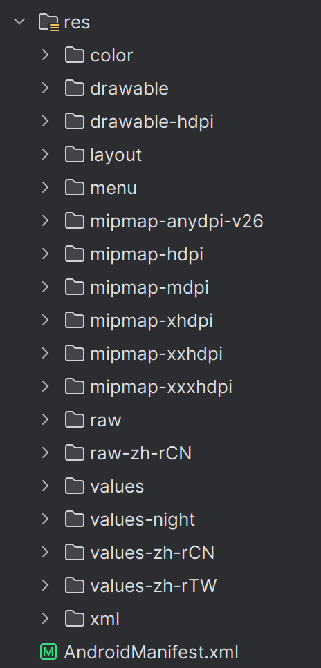

# Android 的资源库

Android 的资源库存储着 APP 的本地资源，包括布局文件、图片、音频、字符串、颜色等内容，这些资源使用 XML 语法编写，被存储在项目文件的 res 目录下，在 APP 运行时可以被调用。

<center>
    
</center>

## 布局文件

布局文件一般被存储在 layout 目录下，你需要使用多种 `Layout` 将对应的部分插入到界面对应的位置并使用各种各样的 `View` 单独或嵌套在 `Layout` 内作为页面展示的元素。下面是一个示例：

```xml
<?xml version="1.0" encoding="utf-8"?>
<LinearLayout xmlns:android="http://schemas.android.com/apk/res/android"
    xmlns:app="http://schemas.android.com/apk/res-auto"
    xmlns:tools="http://schemas.android.com/tools"
    android:layout_width="match_parent"
    android:layout_height="90dp"
    android:orientation="vertical"
    android:paddingLeft="12dp"
    android:paddingRight="12dp">

    <View
        android:layout_width="match_parent"
        android:layout_height="0.5dp"
        android:background="#F8F8F8" />

    <LinearLayout
        android:layout_width="match_parent"
        android:layout_height="match_parent"
        android:paddingTop="10dp"
        android:paddingBottom="10dp">

        <RelativeLayout
            android:layout_width="0dp"
            android:layout_height="match_parent"
            android:layout_weight="2">

            <TextView
                android:id="@+id/news_title"
                android:layout_width="wrap_content"
                android:layout_height="wrap_content"
                android:layout_alignParentTop="true"
                android:layout_marginTop="-3dp"
                android:ellipsize="end"
                android:maxLines="2"
                android:text="@string/news_title"
                android:textColor="#222222"
                android:textSize="18sp" />

            <TextView
                android:id="@+id/news_desc"
                android:layout_width="wrap_content"
                android:layout_height="wrap_content"
                android:layout_alignParentBottom="true"
                android:ellipsize="end"
                android:maxLines="1"
                android:text="@string/news_author"
                android:textColor="#BFBFBF"
                android:textSize="10sp"
                tools:ignore="SmallSp" />
        </RelativeLayout>

        <ImageView
            android:id="@+id/news_image"
            android:layout_width="0dp"
            android:layout_height="match_parent"
            android:layout_weight="1"
            android:scaleType="fitXY"
            android:src="@drawable/news_image"
            android:layout_marginStart="20dp" />

    </LinearLayout>

    <View
        android:layout_width="match_parent"
        android:layout_height="0.5dp"
        android:background="#F8F8F8" />
</LinearLayout>
```

得到的布局如下图，如你所见，前后两个 View 是上下占位边框，中间的部分是一组横向线性排列，权重为 $2:1$；左边是两个文本框组成的，右边是一张图片。布局文件的编写还是比较直观的，更多地需要在实践中提高使用的熟练度，这里不再赘述。

<center>
    
</center>

!!! tip "几点关于布局文件的 tip"

    1. 布局文件只能有一个根元素。
    2. 上图可视化布局文件的工具是 Android Studio 的布局编辑器，你也可以在布局编辑器中直接添加元素并调整相关参数，任何更改 Android Studio 都会帮你写入布局文件内，不过直接对布局文件进行修改是更推荐的做法。

## 其他资源类型

除了布局文件以外，Android 还有很多类型的资源，比如颜色列表状态资源，它一般存储在 values 目录下的 `colors.xml`。

```xml
<?xml version="1.0" encoding="utf-8"?>
<resources>
    <color name="purple_200">#FFBB86FC</color>
    <color name="purple_500">#FF6200EE</color>
    <color name="purple_700">#FF3700B3</color>
    <color name="teal_200">#FF03DAC5</color>
    <color name="teal_700">#FF018786</color>
    <color name="black">#FF000000</color>
    <color name="white">#FFFFFFFF</color>
    <color name="customBlue">#66CCFF</color>
    <color name="customGreen">#39C5BB</color>
    <color name="customGrey">#787a7a</color>
    <color name="customWhite">#FAFAFA</color>
</resources>
```

还有菜单资源，一般存储在 menu 目录下。

```xml
<?xml version="1.0" encoding="utf-8"?>
<menu xmlns:android="http://schemas.android.com/apk/res/android">
    <item
        android:title="主页"
        android:id="@+id/home"
        android:icon="@drawable/ic_home_black_24dp"/>
    <item
        android:title="搜索"
        android:id="@+id/search"
        android:icon="@android:drawable/ic_menu_search"/>
    <item
        android:title="记录"
        android:id="@+id/history"
        android:icon="@android:drawable/ic_menu_recent_history"/>
</menu>
```

Android 还有更多种资源类型，这里一一介绍并不现实，想要了解更多的可以跳转 [资源类型简介](https://developer.android.google.cn/guide/topics/resources/available-resources?hl=zh-cn)。
