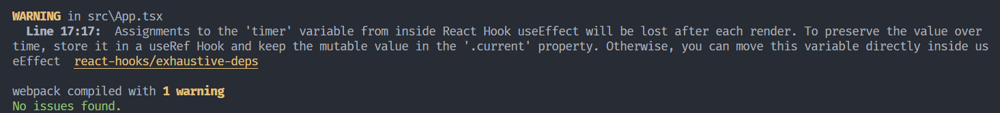

# 函数组件

我们通过类组件简单介绍了 React 的核心概念，但是类组件有下述比较明显的问题：

- 编码繁琐，尤其在使用 TypeScript 语言的时候
- 可能会出现 `this` 的指向不明确的问题
- JavaScript 语言的类语法仅仅是语法糖，并非是完全符合面向对象思路的

所以在新版本的 React 框架中，我们更为推荐大家编写函数组件。

函数组件的基本思维是将整个组件思考为函数，函数的参数为组件的属性，而返回值就是组件的显示方式（即类组件的 `render` 函数返回值）。也就是说，将组件视作一种接收属性，获取组件渲染指示的数据流管道更为可行。这种思路下开发者可以简单地组合各种管道来实现 Web 应用。

比如说下述没有设置组件状态的、没有使用生命周期方法的正方形组件：

```typescript
interface SquareProps {
    readonly size: number;
    readonly color: string;
}

class Square extends React.Component<SquareProps> {
    render(): ReactElement {
        return <div
            style={{
                width: this.props.size,
                height: this.props.size,
                backgroundColor: this.props.color
            }}
        />;
    }
}
```

就可以转写为下述函数组件：

```typescript
interface SquareProps {
    readonly size: number;
    readonly color: string;
}

const Square = (props: SquareProps): ReactElement => {
    return <div
        style={{
            width: props.size,
            height: props.size,
            backgroundColor: props.color
        }}
    />;
}
```

这样的转写并不改变组件的本质，使用该组件的方式也和类组件一致。

## Hooks 简要介绍

在转写上述类组件的时候，我们注意到如果组件具有状态或者使用了生命周期方法，则无法转写。这里，React 提供的解决方式是使用 Hooks。

### 管理组件状态

我们首先介绍管理状态需要使用的 Hooks，即 `useState` 函数。比如说我们依然是将正方形的颜色变为其状态，由组件自身管理，其代码大致为：

```typescript hl_lines="7 10 17"
interface SquareProps {
    readonly size: number;
    readonly color: string;
}

const Square = (props: SquareProps): ReactElement => {
    const [color, setColor] = useState(props.color);

    const switchColor = () => {
        setColor((prev: string) => prev === "red" ? "blue" : "red");
    };

    return <div
        style={{
            width: props.size,
            height: props.size,
            backgroundColor: color
        }}
        onClick={switchColor}
    />;
}
```

这里高亮的三行表现出使用 Hooks 的时候需要修改的地方。首先注意第 7 行，这里使用了 `useState` 函数，该函数接受的是需要设定的状态的初始值，返回的是该状态和用于设定该状态的函数。这里我们设定的状态为 `color`，初始值为 `props.color`，而 `setColor` 和类组件之中的 `setState` 类似，用于修改状态。

这里注意第 10 行如何应用 `setColor` 函数。该函数和 `setState` 一样，可以接收新状态作为参数，也可以接受一个回调函数作为参数。同样的，该函数也是一个异步函数，也会触发组件重新渲染。

??? note "`useState` Hooks 的大致原理"

    在函数组件条件下，组件的状态是交由全局变量维护，也就是说所有组件的状态将会保存在一个全局的数组之中。而我们在使用 `useState` 创建新的状态的时候，就会在这个数组的尾部新建一个元素，将这个元素的索引封装进入闭包，这个闭包就是用于修改这个状态的函数。

    比如说 `useState` 的一种可能的实现为：

    ```typescript
    let states: any[] = [];
    let cursor: number = 0;

    const useState = <T> (initalState: T): [T, (arg: T) => void] => {
        let state: T = (states[cursor] ?? initalState) as T;
        const _cursor = cursor;
        const setState = (newState: T): void => {
            states[_cursor] = newState;
        }
        cursor += 1;
        return [state, setState];
    }
    ```

    这里，数组 `states` 管理了所有组件的状态，另外有一个指针 `cursor` 用于访问这个数组。在我们调用 `useState` 的时候，其首先会检测目前 `cursor` 指向的位置是否已经写入了某个状态，如果已经写入则将其取出作为目前的状态，否则会用该函数接受的初始值作为目前的状态。

    随后，该函数会保留一份当前 `cursor` 的副本 `_cursor`，将其包装在闭包 `setState` 中，而 `setState` 的作用就是修改 `_cursor` 指向的那一个状态。最后递增 `cursor`，将目前的状态 `state` 和用于修改状态的函数 `setState` 返回即可。

### 管理组件副作用——替换生命周期方法

由于函数组件将组件看作是接收组件属性传出组件显示方式的数据流管道，所以其主要作用就是渲染，即 `render` 函数负责的部分。那么所有生命周期方法规定的，在组件挂载后、卸载前的行为，就统称为**副作用**。

我们先简要介绍 `useEffect` 这个 Hooks，其原型为：

```typescript
useEffect(callback, depList);
```

这里 `callback` 就是我们需要执行的一个回调函数，也就是规定副作用的函数。而 `depList` 为副作用依赖项列表，表示该副作用取决于哪些变量。

所谓依赖项，就是每当 `useEffect` 执行的时候，会检测所有依赖项相较于上一次是否发生了变化，如果发生变化，才会执行 `callback` 回调函数。

那么我们就可以通过控制 `depList` 来控制副作用的执行时机。一般而言，`depList` 有三种写法。

#### 通过 `depList` 控制副作用发生时机

**`depList` 置 `undefined`**

此时相当于不传入第二个参数 `depList`。此时这个 Hooks 的语义可以理解为副作用不依赖于任何变量，始终会被执行。而 `useEffect` 被调用的时机就是函数组件调用的时机，即函数组件渲染的时候。所以，如果 `depList` 置 `undefined`，意味着副作用会在**每一次渲染后执行**。

在每一次渲染之后都会执行的副作用等价于 `componentDidMount` 和 `componentDidUpdate` 两个生命周期方法合并。

这类副作用往往是根据组件更新完毕后的新状态来手动调整 DOM 树结构、记录日志等行为。比如说我们可以在正方形类组件上添加下述 Hooks，让其被点击次数能够显示在网页标题上：

```typescript hl_lines="9-11"
interface SquareProps {
    readonly size: number;
    readonly color: string;
}

const Square = (props: SquareProps): ReactElement => {
    const [clickCnt, setClickCnt] = useState(0);

    useEffect(() => {
        document.title = `You have clicked it for ${clickCnt} time(s).`;
    });

    return <div
        style={{
            width: props.size,
            height: props.size,
            backgroundColor: props.color
        }}
        onClick={() => setClickCnt((o) => o + 1)}
    />;
}
```

这样，在用户每次点击正方形触发重新渲染（即函数 `Square` 重新执行）的时候，`useEffect` Hooks 接收的回调函数就会执行一次，从而修改网页标题内容。

**`depList` 置空列表 `[]`**

区别于置 `undefined`，置空列表表示该副作用应当依赖于某些变量但是我们没有提供，因而除了在第一次执行该 Hooks 时之外，其余时刻都会由于 `depList` 为空而判定为不执行。所以，如果 `depList` 置空列表 `[]`，意味着副作用只会在**第一次渲染后执行**。

只在第一次渲染之后执行的副作用等价于 `componentDidMount` 生命周期方法。

!!! caution "不太直观的解释？"

    可能会有读者在阅读上述讲解后还有困惑，为何 `depList` 置 `undefined` 是这般行为而置空列表又是那般，乃至认为讲解很反直觉。

    我们承认上述讲解的目的仅仅是让大家在不学习 Hooks 源码的条件下就能使用 Hooks，但如果想要理解其行为为何如此，可以阅读这一部分末尾我们提供的简化版 Hooks 实现。

比如说我们希望在组件第一次渲染的时候从网络获取数据，就可以如下编写：

```typescript
// Some other components
useEffect(() => {
    fetchData(dataURL, /* OTHER PARAMS */)
        .then((res) => setData(res))
        .catch((err) => {
            writeLog(err);
            setData("[ERR]");
        });
}, []);
```

**`depList` 置非空列表**

依赖项非空就意味着该副作用依赖于这些依赖项，React 引擎会在每次渲染的时候检查这些依赖项是否和先前的存储一致，若不一致则会触发副作用（第一次渲染始终执行）。

#### 副作用的清除逻辑

至此为止，我们已经基本上了解了如何通过 `depList` 参数控制副作用的产生时机。但是如果我们观察一下上面提到的的这一段示例代码：

```typescript
useEffect(() => {
    document.title = `You have clicked it for ${clickCnt} time(s).`;
});
```

可以发现，这里每一次渲染都会给 `useEffect` 传入一个不一样的函数（因为 `clickCnt` 发生了改变），这其实表明了 `useEffect` 这个 Hooks 的一个特征，即每一个副作用是属于每一次渲染的。这是和生命周期方法很不一样的地方，因为生命周期是属于一个组件的，而不是特定的每一次渲染。

但是我们认为将副作用绑定到每一次渲染可能是更好的选择，原因在于副作用的清除逻辑。

我们先前提到过，如果需要给组件绑定计时器、事件监听器等耗费资源的对象，就需要在组件挂载后分配资源，在组件卸载前释放资源。如果需要分配的是类似计时器这类在整个组件生命周期中都不会变化的对象，则将创建和销毁计时器绑定到一个组件上和绑定到具体的某次渲染上均可以。

但是考虑事件监听器，事件监听器监听的对象可能会在组件更新的时候发生变化，这个时候将创建和销毁监听器绑定到组件上就不正确。也就是说，仅仅通过 `componentDidMount` 和 `componentWillUnmount` 生命周期方法并不能完成事件监听器对象的管理，还需要再在 `componentDidUpdate` 方法内实现回收旧监听器和分配新监听器的逻辑。

这个时候显然将事件监听器的管理和具体的某一次渲染绑定是更为合理的，逻辑也更为简洁。在这样的条件下，监听器的管理逻辑就是，每一次渲染后，回收旧监听器并分配新监听器。

---

我们在 `useEffect` Hooks 内规定副作用清除逻辑的方法为在 `callback` 内返回一个函数，在返回的函数内规定副作用清除方式。

比如说考虑下述带有计时器，定时变色的 `Square`：

```typescript
interface SquareProps {
    readonly size: number;
    readonly color: string;
}

interface SquareStates {
    readonly color: string;
}

class Square extends React.Component<SquareProps, SquareStates> {
    timer: any;

    constructor(props: SquareProps) {
        super(props);
        this.state = { color: props.color }
    }

    switchColor(): void {
        this.setState((prev: SquareStates) => ({
            ...prev,
            color: prev.color === "red" ? "blue" : "red",
        }));
    }

    componentDidMount(): void {
        this.timer = setInterval(() => this.switchColor(), 1000);
    }

    componentWillUnmount(): void {
        clearInterval(this.timer);
    }

    render(): ReactElement {
        return <div
            style={{
                width: this.props.size,
                height: this.props.size,
                backgroundColor: this.state.color
            }}
        />;
    }
}
```

可以改写为：

```typescript hl_lines="14-17"
interface SquareProps {
    readonly size: number;
    readonly color: string;
}

const Square = (props: SquareProps): ReactElement => {
    const [color, setColor] = useState(props.color);
    let timer: any;

    const switchColor = () => {
        setColor((prev: string) => prev === "red" ? "blue" : "red");
    };

    useEffect(() => {
        timer = setInterval(switchColor, 1000);
        return () => clearInterval(timer);
    }, []);

    return <div
        style={{
            width: props.size,
            height: props.size,
            backgroundColor: color
        }}
    />;
}
```

这里我们在作为 `useEffect` 的第一个参数的回调函数中返回了一个回调函数，其规定了清除计时器的逻辑。

!!! caution "仅供参考的写法"

    如果你使用了上述写法，可能会得到这样的警告：

    

    这个警告告诉我们，`timer` 作为函数内部变量，会随着渲染结束（函数执行完毕）而消失，如果需要将其持久化，需要使用另外一个 `useRef` Hooks。

    这其实就是函数组件的局限所在，由于函数的生命周期仅能维持在一次渲染中，所以如果涉及到需要构造和组件生命周期一般长的变量，就不得不使用各种 Hooks 维护，比如组件的各种状态，比如这里的计时器。

    `useRef` Hooks 会构建一个和组件生命周期一般长的变量，其初始值为 `useRef` 接受的参数。我们可以通过该 Hooks 返回变量的 `.current` 属性获取到实际的变量值。所以说，上述代码的正确编写方式应该为：

    ```typescript hl_lines="8 14-20"
    interface SquareProps {
        readonly size: number;
        readonly color: string;
    }

    const Square = (props: SquareProps): ReactElement => {
        const [color, setColor] = useState(props.color);
        const timerRef = useRef<undefined | NodeJS.Timer>(undefined);

        const switchColor = () => {
            setColor((prev: string) => prev === "red" ? "blue" : "red");
        };

        useEffect(() => {
            timerRef.current = setInterval(switchColor, 1000);
            return () => {
                if (timerRef.current !== undefined)
                    clearInterval(timerRef.current);
            }
        }, []);

        return <div
            style={{
                width: props.size,
                height: props.size,
                backgroundColor: color
            }}
        />;
    }
    ```

??? note "`useEffect` Hooks 的大致原理"

    `useEffect` 采用了和 `useState` 类似的设计思路，只不过其在全局数组内存放的是每一个副作用的依赖列表。每次执行 `useEffect` 的时候都会查找依赖列表来确定是否需要执行副作用。

    其可能的实现为：

    ```typescript
    let effectDeps: any[][] = [];
    let cursor: number = 0;

    const useEffect = (callback: () => void, depList: any[]): void => {
        if (effectDeps[cursor] === undefined) {
            effectDeps[cursor] = depList;
            cursor += 1;
            callback();
            return;
        }

        const depsChanged = effectDeps[cursor]
            .some((dep: any, ind: number) => dep !== depList[ind]);
        if (depsChanged) {
            callback();
            effectDeps[cursor] = depList;
        }
        cursor += 1;
    }
    ```

    这样实际上就解释了为何 `depList` 置 `undefined` 时每次渲染都会执行副作用，这是因为 `effectDeps` 数组内一直保存的是 `undefined`，所以 `useEffect` 在第一个 `if` 处就会一直判真，从而每次都会执行副作用。

    同样也能解释为何 `depList` 置空列表仅会在第一次渲染执行副作用，这里不再赘述。

## Hooks 的使用规范

Hooks 的使用规范大致可以归结为两条：

- 必须在组件最顶部使用 Hooks，且 Hooks 不能位于条件、循环、子函数之中
- 只能在 React 函数组件中使用 Hooks

只要遵循这两条即可保证 Hooks 的正确使用。

??? note "为什么是这两条规则"

    如果你已经阅读过 `useState` 和 `useEffect` 的简要实现，就会发现这两个 Hooks 都依赖于一个重要的全局变量，即 `cursor`。这个变量维护了当前 Hooks 指向的状态（或依赖项列表）。而 `cursor` 的变化仅仅是自增，这意味着，如果各个 Hooks 的执行序列发生变化，就会导致 `cursor` 偏移，从而导致 Hooks 无法正确解析状态（或依赖项列表）。

    比如说我们在某一个组件顶部按顺序调用下述 Hooks：

    ```typescript
    useState(1); // #1
    useState(2); // #2
    useState(3); // #3
    ```

    这里 `cursor` 就会递增三次，将三个状态连续记录在全局数组中。

    然而如果我们将某一个 Hooks 放置在条件语句中：

    ```typescript
    useState(1); // #1
    if (something) {
        useState(2); // #2
    }
    useState(3); // #3
    ```

    就可能导致第二个 Hooks 不被执行，从而导致 `cursor` 没有递增。此时执行第三个 Hooks 的时候，`cursor` 指向了第二个状态，这就导致了错误。
