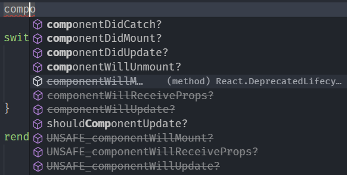

# 生命周期方法

## React 组件的生命周期

我们在实际的开发之中，前端需要显示的数据、显示数据的方式往往需要根据从后端、公开平台等处拉取的信息确定，那么我们就需要考虑应当何时发起网络请求拉取数据。

在叙述何时拉取数据之前，我们可以先了解一下 React 组件的生命周期，也就是一个 React 组件从构建到解构的全过程：

- 准备挂载，这个时候属性会被传递到组件的构造函数之中，实例化一个组件，同时创设相应的 `state`。

- 挂载组件，这个时候框架调用 `render` 函数，生成组件的展示方式并渲染，**挂载完毕之后会使用 `React.Component` 类之中定义的 `componentDidMount` 生命周期方法**，表示组件挂载完毕。

- 监听组件的 `setState` 方法调用，一旦组件的状态改变，就代表着可能会导致组件的显示方式改变，此时框架会重新调用 `render` 函数进行重新渲染。

- 卸载组件，当组件需要被移除的时候，**在卸载之前会调用 `React.Component` 类之中定义的 `componentWillUnmount` 生命周期方法**，表示即将卸载组件。

注意这里提到的 `componentDidMount` 和 `componentWillUnmount` 方法，这两个方法会在对应的生命周期时间点由 React 框架自动调用。前者调用时组件已经构建完毕且挂载到 DOM 树上，此时便可以从网络拉取数据并写入对应的成员变量或者调用 `this.setState` 根据获取的数据重新渲染组件。

而后者调用时意味着组件即将卸载，此时应当清除掉一些即将不使用的、在后台运行占用资源的计时器、事件监听器等对象，保证资源不浪费。

??? note "更完整的生命周期"

    **【注意】**这里可能包含过时乃至危险的编码方法，如果只需要学习生命周期方法的运用可以跳过，本部分仅用于深入了解 React 框架。

    如果使用 VS Code 等带有代码提示的工具编写代码，我们可以看到还有很多其他的生命周期方法：

    

    这些方法实际上描述了更为细致的 React 组件生命周期，现在我们逐步表述。

    - 组件挂载
        - 首先调用构造函数 `constructor()`，其接受的参数为组件属性，同时初始化组件状态。在 ES6 JavaScript 类语法糖出现之前，构造函数由 `getDefaultProps()` 和 `getInitialState()` 两个方法替代
        - 其次调用 `componentWillMount()` 方法，用户可以 override 该方法实现自定义功能
        - 然后调用 `render()` 方法获取组件的显示方式，渲染组件
        - 最后调用 `componentDidMount()` 方法，用户可以 override 该方法实现自定义功能
    - 组件更新
        - 如果是接受新的组件属性进行更新，调用 `componentWillReceiveProps()` 方法。该方法接受的参数为该组件的新属性
        - 首先调用 `shouldComponentUpdate()` 方法，该方法返回布尔值，表示组件此时是否需要更新。若得到 `false`，则组件停止更新，否则继续向下执行。该方法接受的参数为该组件的新属性和新状态
        - 其次调用 `componentWillUpdate()` 方法，用户可以 override 该方法实现自定义功能。该方法接受的参数为该组件的新属性和新状态
        - 然后调用 `render()` 方法获取组件显示方式，渲染组件
        - 最后调用 `componentDidUpdate()` 方法，表示组件更新完毕。该方法接受的参数为组件更新前的旧属性和旧状态
    - 组件卸载
        - 调用 `componentWillUnmount()` 方法，用户可以 override 该方法实现自定义功能
    - 组件错误处理
        - 调用 `componentDidCatch()` 方法，用户可以 override 该方法实现自定义功能。该方法接受的参数为错误信息
    - 组件监听的方法调用
        - `setState()` 方法发起组件更新的**请求**，会触发一次重新渲染，具体用法先前已经讲解
        - `forceUpdate()` 方法发起组件更新的**命令**，与 `setState()` 方法不同在其会无视 `componentShouldUpdate()` 的返回值，正常完成组件更新流程（包括调用 `componentDidUpdate()` 方法）

    总体而言，React 组件的生命周期大致为下图（ES5 版本，不包括组件错误处理和方法监听）：

    

    图片来源：<https://www.cnblogs.com/gdsblog/p/7348375.html>。

    !!! caution "不安全的生命周期方法"

        我们可以注意到 `componentWillMount()` 等方法已经被标记为 Deprecated，这是因为这类方法往往可能会在组件未构建完毕或者更新完毕的时候修改组件，这是有数据竞争危险的。所以在 React 17/18 版本的过渡之中，这些方法会被废弃。这些生命周期方法包括：

        - `componentWillMount()`
        - `componentWillUpdate()`
        - `componentWillReceiveProps()`

## 实例——为组件挂载计时器

现在我们着重讲解如何利用 `componentDidMount` 和 `componentWillUnmount` 方法。这两个生命周期方法标记着组件生命周期的开始与终结，所以如果我们需要使用一个和组件同时构造、同时释放的对象，我们就需要在这两个生命周期方法内构建和释放这个对象。其中一个例子就是计时器。

我们现在考虑先前编写的小正方形，现在我们能够通过修改组件状态来控制它的颜色，但我们实际上还是要通过用户来触发我们修改颜色的函数。如果我想要将这个函数改为自动调用，不可避免地就需要引入计时器。

首先我们需要将计时器声明为类成员以符合 TypeScript 的检查：

```typescript
class Square extends React.Component<SquareProps, SquareStates> {
    timer: any;
    // ...
}
```

之后，我们需要在 `componentDidMount` 方法中，在组件刚挂载的时候构建计时器对象：

```typescript
// Component 'Square'
componentDidMount(): void {
    this.timer = setInterval(() => this.switchColor(), 1000);
}
```

`setInterval` 方法设定一个周期计时器，上述计时器将会每间隔 1000 毫秒调用一次 `this.switchColor` 方法。

最后，我们需要在 `componentWillUnmount` 方法中，在组件即将卸载的时候删除计时器对象：

```typescript
// Component 'Square'
componentWillUnmount(): void {
    clearInterval(this.timer);
}
```

使用 `npm run start / yarn start` 命令即可运行应用，看到一个每隔一秒变色的正方形了。

## `setState` 方法与可能的循环渲染

初次使用 React 框架并尝试维护组件状态的时候，往往会遇到滥用 `setState` 方法导致组件崩溃的错误。

尝试在 `Square` 组件内写入这样的代码：

```typescript
// Component 'Square'
componentDidUpdate() {
    this.setState((o) => o);
}
```

再运行 React 应用，你应当能观察到 React 崩溃。请自行思考原因，如果没有思路，可以打开浏览器控制台查看报错原因或者展开下面的笔记框阅读我们给出的解释。

??? note "React 崩溃的原因"

    如果你打开了浏览器的控制台，应当会看到类似下图的报错：

    

    现在我们回顾调用 `setState` 时 React 框架的处理流程。如果调用后通过了 `shouldComponentUpdate` 的检查，则就会进入组件更新的处理流程，这期间会调用 `componentWillUpdate`、`componentDidUpdate`、`render` 等方法，如果这些方法内又一次调用了 `setState` 方法，则又会触发组件更新，从而导致循环渲染，这种死循环会导致 React 框架崩溃退出。

    所以我们应当避免在 `componentWillUpdate`、`componentDidUpdate` 内调用 `setState`，即使需要调用，也仅能够在某个条件分支语句内使用，比如：

    ```typescript
    componentDidUpdate(prevProps) {
        if (prevProps.foo !== this.props.foo) {
            this.setState(/* SOMETHING */);
        }
    }
    ```

    这样至少不会导致最简单的死循环，但是这样还是有可能导致重复渲染，进而导致性能浪费。