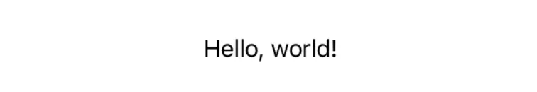
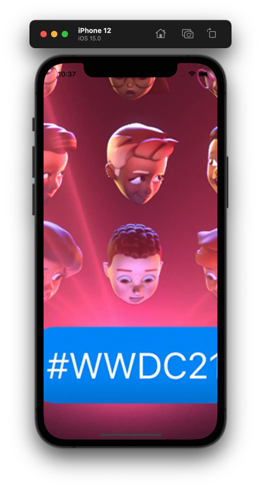
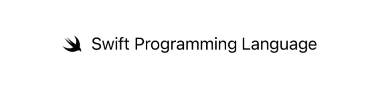
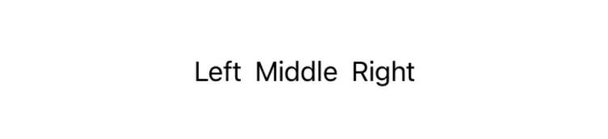
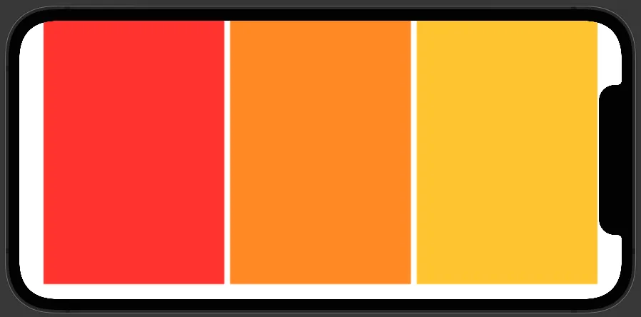
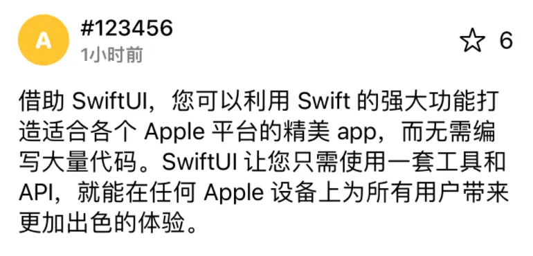
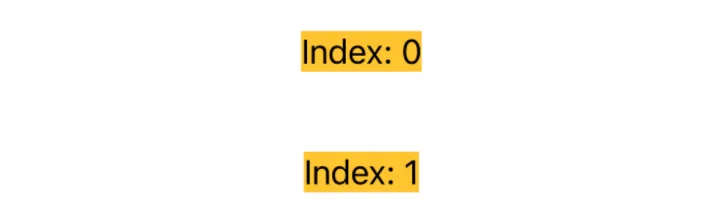
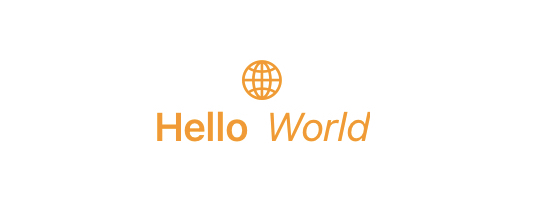

接下来，我们将展开介绍如何构建 View。

## View 的组合方式

在 `body` 中，有一些非常方便的方式来组合不同的 View。另外，`body` 还对其中的表达式有一定的限制。

### 组合

在 `body` 中，你可以通过这几种方式组合多个 View，**不需要写出 `return`**：

**条件控制语句**

你可以用 `if-else` 语句有条件地显示不同的 View：

```swift
if type == .text {
    Text("Hello, world!")
} else if type == .image {
    Image("hello-world")
} else {
    Color.blue
}
```

或者，只有 `if`：

```swift
if revealGrade {
    Text(student.gpa)
}
```

当然，`if let` 语句也是可以的：

```swift
if let npyName = student.npyName {
    Text(npyName)
}
```

你还可以用 `switch`：（实际上编译器将其转化为 `if-else` 语句）

```swift
switch type {
case .text: Text("Hello, world!")
case .image: Image("hello-world")
default: Color.blue
}
```

**多个 View**

你可以一次返回多个 View，这种 View 叫做 `TupleView`：

```swift
Text("Hello, world!")
Image("hello-world")
Color.blue
```

一般这种 `TupleView` 多用于 View 的排列。比如，将几个 View 在垂直方向依次排列：

```swift
VStack {
    Text("Hello, world!")
    Image("hello-world")
}
```

我们将在下面进一步介绍 View 的排列。

!!! note "`VStack` 构造函数的参数"

    上面的 `VStack` 以及大括号包括的内容，实际上是 `VStack` 的构造函数。根据文档，`VStack` 构造函数的签名如下：
    
    ```swift
    init(alignment: HorizontalAlignment = .center, spacing: CGFloat? = nil, content: () -> Content)
    ```

    我们前两个参数使用了提供的默认值，我们提供的实际上是第三个参数 `content`：它是一个**无参数、返回值为 `Content` 的匿名函数**。（这里的 `Content` 是 `VStack` 的模版参数，表示「内容 View 的类型」）

    在 Swift 中，如果函数的最后一个参数为函数，那么它可以写到括号外面，并且省略标签。上面 `VStack` 的构造函数实际上是：

    ```swift
    VStack(content: {
        Text("Hello, world!")
        Image("hello-world")
    })
    ```
    
    顺便说一句，`content` 的返回值的类型是 `TupleView<(Text, Image)>`，并不是一个真正的 `Tuple`。


### 表达式

`body` 与普通函数不同，它对函数体内的允许的表达式有限制。

同时进行变量的声明和赋值是允许的：

```swift
var body: some View {
    let description = x > 127 ? "overflow" : "normal"
    Text(description)
}
```

但 `var` 和 `let` 的声明、赋值表达式不被允许：

```swift
// Error: Closure containing a declaration cannot be used with result builder 'ViewBuilder'
var body: some View {
    var description: String
    ...
}

// Error: Type '()' cannot conform to 'View'
var body: some View {
    var description = ""
    description = "hello"
    ...
}
```

另外，`for` 循环也是不被允许的。我们有另外的方法进行类似的迭代。

上述例子中，类型遵循 `View` 的值（如 `Text(description)`）会作为部分结果（partial result）递归地参与 `body` 最后结果的计算，而其余允许的表达式（如 `let description = x > 127 ? "overflow" : "normal"`）在计算 `body` 的值的时候会被忽略。

!!!note "简单介绍 `ViewBuilder`"
    实际上，`body` 之所以能够有这些特性，是因为 `body` 有隐式的 [`@ViewBuilder`](https://developer.apple.com/documentation/swiftui/viewbuilder/) 修饰：

    ```swift hl_lines="3"
    protocol View {
        associatedtype Body: View
        @ViewBuilder var body: Body { get }
    }
    ```

    被 `@ViewBuilder` 修饰的函数，不使用显式的 `return` 来返回，而是通过“收集”函数体中的`View` 来构建最终的返回值。比如：

    ```swift
    let greeting = "Hello"
    Text(greeting)
    Color.blue
    ```

    编译器“收集”到两个 View：`Text` 和 `Color`（忽略 `let greeting = "Hello"`）。接着，调用 `ViewBuilder` 的一个构建 View 的函数：

    ```swift
    static func buildBlock<C0, C1>(_ c0: C0, _ c1: C1) -> TupleView<(C0, C1)> where C0 : View, C1 : View
    ```

    这个函数接受两个 `View` 作为参数，最终生成**单个**返回值 `TupleView<(Text, Color)>`。

    其他的特性，比如 `if-else` 语句，都是由类似的机制来实现的。不难理解，只要不断递归地将 View 合并，最终就能生成一个单一的返回值。

    `ViewBuilder` 的机制实际上是通过一种叫 result builder 的语法实现的。如果感兴趣可以参考 [SE0289: Result builders](https://github.com/apple/swift-evolution/blob/main/proposals/0289-result-builders.md)。

## 一些常用的 View

我们终于基本介绍完相关的语法规则了，接下来就是利用各种原生的 View 来构建我们的 UI 了。在这里只会介绍各种 View 最基本的用法，其余用法请参考开发者文档。

你最好亲自尝试一下下面的代码，并在预览模式中实时查看。

### 组件

**只读文本 `Text`**

用于显示只读文本。

你可以从字符串创建：

```swift
Text("Hello, world!")

let string = "Hello, world!"
Text(string)
```

结果为：



也可以用 Markdown 字符串创建带格式的文本。注意只有字面值能够直接渲染为 Markdown 格式，对于字符串变量需要 `AttributedString`：

```swift
Text("Hello, *world*!")

let string = "Hello, *world*!"
let attrStr = try! AttributedString(markdown: string)
Text(attrStr)
```

结果为：


可以使用 `.font(_:)`、`.foregroundColor(_:)`、`.italic(_:)` 等 modifier 改变字体、颜色等：

```swift
Text("Hello, world!")
    .font(.system(size: 24, weight: .bold, design: .serif))
    .italic()
    .foregroundColor(.blue)
    .underline()
```

最终的效果为：


最后，值得一提的是 `Text` 的加法运算符，它可以将两个样式不同的 `Text` 拼接在一起：

```swift
let start = Text("L").bold().font(.title)
let remaining = Text("orem ipsum dolor sit amet, consectetur adipiscing elit....")

start + remaining
```

效果为：


**图片 `Image`**

显示图标或资源文件图片。

!!! note "添加图片资源的方法"

    - Swift Playgrounds：将图片拖动到文件目录中
    - Xcode Project：将图片拖动到 `Assets.xcassets` 中。

使用 `Image(systemName:)` 显示系统图标：

```swift
Image(systemName: "swift")
```

结果为：


!!! info

    关于系统内置图标的查询，请参考 [SF Symbols](https://developer.apple.com/sf-symbols/)。

使用 `Image(_:)` 显示资源文件。

比如，我们有一个如下图的名为 `wwdc21` 的图片文件：


以下几种不同的代码会产生不同的结果：

```swift
// Case 1
Image("wwdc21")

// Case 2
Image("wwdc21")
    .resizable()

// Case 3
Image("wwdc21")
    .resizable()
    .aspectRatio(contentMode: .fit)

// Case 4
Image("wwdc21")
    .resizable()
    .aspectRatio(contentMode: .fill)
```

|Case 1|Case 2|Case 3|Case 4|
|:---:|:---:|:---:|:---:|
|图片原有尺寸|占满可获得的空间|按原有比例适合空间|按原有比例占满空间|
|||||

一个 `Image` 如果不加上 `.resizable()` 的话只会按照固有像素显示，只有加上 `.resizable()` 才能进行缩放。`.aspectRatio(_:contentMode:)` 使得 `Image` 能够根据可用空间和长宽比进行缩放。

!!! note "`Image` 的布局性质"

    注意，`Image` 所占的空间可能会超出可用的空间。对于上面的 Case 4，在 Xcode 预览中选中图片，可以看到其大小：

    

    这种性质在很多地方会有意想不到的效果，如即将介绍的 `ZStack`。如果需要将图片限制在可用空间内，可以使用 `Color`，它仅占据所有可用空间：

    ```swift
    Color.clear.overlay {
        Image("wwdc21")
            .resizable()
            .aspectRatio(contentMode: .fill)
    }
    ```

**图标 & 文字 `Label`**

显示图标和文字。

```swift
Label("Swift Programming Language", systemImage: "swift")
```

效果为：



另外，你可以用 `.font(_:)` 修改其字体。

!!! note "`Label` 的特殊之处"

    `Label` 相较于普通的左右排布（接下来要介绍的 `HStack`）的特殊之处在于，在某些系统原生的排列中，多个 `Label` 的图标和文字会自动对齐。

**按钮 `Button`**

按钮。

文字按钮：

```swift
Button("Button") {
    print("Button pressed")
}
```

以一个 View 作为按钮：

```swift
Button(action: { print("Button pressed") }) {
    Image(systemName: "swift")
}
```

上面的代码也可以写成：

```swift
Button {
    print("Button pressed")
} label: {
    Image(systemName: "swift")
}
```

!!! note "Multiple Trailing Closures"

    如果一个函数最后若干个参数均为函数，如：

    ```swift
    func foo(para1: Int, func1: () -> Void, func2: () -> Void, func3: (Int) -> Void)
    ```

    那么，调用时这些函数参数可以写到小括号外面，第一个可以省略标签，其余需要加上标签：

    ```swift
    foo(para1: 127) {
        // func1 goes here
    } func2: {
        // func2 goes here
    } func3: { value in
        // func3 goes here
    }
    ```

    这种写法是 Swift 中一种叫 [multiple trailing closures](https://github.com/apple/swift-evolution/blob/main/proposals/0279-multiple-trailing-closures.md) 的语法，详见[官方文档](https://docs.swift.org/swift-book/LanguageGuide/Closures.html#ID102)。这种写法能提高代码的可读性，我们之后会尽量采用这种写法。

另外，我们可以用 `.buttonStyle(_:)` 来使用系统默认的一些样式：

```swift
Button("Button") {
    print("Button pressed")
}
.buttonStyle(.bordered)
```

效果为：


**菜单 `Menu`**

创建点击显示的菜单。

```swift
Menu("Actions") {
    Button("Duplicate", action: {...})
    Button("Rename", action: {...})
    Button("Delete…", role: .destructive, action: {...})
    Divider()
    Menu("Copy") {
        Button("Copy", action: {...})
        Button("Copy Formatted", action: {...})
        Button("Copy Library Path", action: {...})
    }
}
```

值得注意的是，可以在一个 `Menu` 中内嵌另一级 `Menu`。

效果为：


另外，可以用类似的方法给任何 View 添加长按菜单：

```swift
Image(systemName: "swift")
    .contextMenu {
        Button("Duplicate", action: {...})
        Button("Rename", action: {...})
        ...
    }
```

### 布局与排列

**水平布局 `HStack`**

水平布局。

```swift
HStack {
    Text("Left")
    Text("Middle")
    Text("Right")
}
```

效果为：



<!-- TODO: Spacer -->

另外，`HStack` 还有两个可选参数 `alignment` 和 `spacing`，用于设置对齐和间距。比如，`HStack(alignment: .top, spacing: 20)` 将使子 View 在顶部对齐，两两之间的间距为 `20`。

!!! note "不同 View 具有不同的布局特性"

    注意到，三个 `Text` 并没有占满所有所有空间，而是只占据了所需要的最小空间，这是由 `Text` 的布局特性决定的。与之相对，`Color` 将尽可能占据多的空间：

    ```swift
    HStack {
        Color.red
        Color.orange
        Color.yellow
    }
    ```

    效果为：

    

    不同的布局特性对我们排布多个 View 有重要影响。
    
    限于篇幅，这部分内容无法展开叙述。总的来说，原生 View 有如下两类布局特性：

    - 仅占需要的空间，如 `Text`、`Label`
    - 占据尽可能多的空间，如 `Color`、`Spacer`、`VStack` 等

    通过 `fixedSize`、`layoutPriority`、`frame` 等 modifier，可以更改 View 的布局特性，在此不再展开。

**垂直布局 `VStack`**

垂直布局，与 `HStack` 类似。

```swift
VStack {
    Text("Top")
    Text("Middle")
    Text("Bottom")
}
```

效果为：


**上下布局 `ZStack`**

上下布局，先写的 View 排布在底层。

```swift
ZStack {
    Color.yellow
    Text("Overlay")
}
```

效果为：


与 `HStack` 和 `VStack` 类似，你可以通过构造函数中的 `alignment` 参数指定这些 View 对齐的方式。

!!! note "`ZStack` 和 `.overlay(_:)`"

    我们还有另外一种方式进行 View 的层叠：

    ```swift
    Color.yellow
        .overlay {
            Text("Overlay")
        }
    ```

    看上去与 `ZStack` 并无二致，其实不然。我们用 `.frame()` 显示地指定 `Color.yellow` 的长宽，来比较一下这两种方式：

    ```swift
    // ZStack
    ZStack {
        Color.yellow
            .frame(width: 40, height: 25)
        Text("Overlay")
    }

    // overlay
    Color.yellow
        .frame(width: 40, height: 25)
        .overlay {
            Text("Overlay")
        }
    ```

    效果分别为：

    |`ZStack`|`.overlay()`|
    |:---:|:---:|
    |||

    可以看到，`ZStack` 以**最大元素**的大小作为其大小，而 `.overlay()` 始终限制在被其修饰的 View 的大小内。

**间距工具 `Spacer`**

间距工具。

`Spacer` 是一个弹性的间距。它本身不会显示，只是占据**大于或等于特定宽度/高度**的空间。

例如：

```swift
HStack {
    Text("Hello")
        .background(Color.yellow)
    Spacer()
}
.background(Color.gray)
```

!!! note

    这里的 `.background(_:)` 只是为了更明显地显示 `HStack` 内部的排列。

效果为：


我们注意到，整个 `Text` 被“挤”到了左边。

我们在上面提到了「大于或等于特定宽度/高度」。`Spacer` 构造函数有一个参数 `minLength`，就是用来指定这个距离的，上面我们忽略了这个参数，使用系统默认的距离。 

需要注意的是，`Spacer` 会占据 View 所**不需要**的空间，但不会挤占 View **需要**的空间（即：`Spacer` 排布的优先级最低）。比如，对于之前提到的会占据所有空间的 `Color`：

```swift
HStack {
    Color.yellow
    Spacer()
}
```

`Spacer` 只占据了默认的最小空间。实际上，如果你把 `Spacer` 的 `minLength` 参数设置为 0：

```swift
Spacer(minLength: 0)
```

对于 `Color` 的情况，`Spacer` 就不会占据任何空间。然而，对于上面 `Text` 的情况，它仍然会占据所有剩余的空间。

另外，如果需要固定宽度/高度的 `Spacer`，可以使用 `.fixedSize()`：

```swift
Spacer(minLength: 20)
    .fixedSize()
```

**其他容器**

SwiftUI 中还有很多用于排布的容器 View，不再展开，具体可以参考 [官方文档](https://developer.apple.com/documentation/swiftui/view-layout-and-presentation)。一些常用的 View 有：

- [`ScrollView`](https://developer.apple.com/documentation/swiftui/scrollview)：可滑动视图
- [`List`](https://developer.apple.com/documentation/swiftui/list)：设置等系统 app 使用的列表视图
- [`NavigationView`](https://developer.apple.com/documentation/swiftui/navigationview)：设置等系统 app 使用的可滑动返回的导航视图
- [`TabView`](https://developer.apple.com/documentation/swiftui/tabview)：时钟等系统 app 使用的分页视图
- [`LazyVStack`](https://developer.apple.com/documentation/swiftui/lazyvstack) 和 [`LazyHStack`](https://developer.apple.com/documentation/swiftui/lazyhstack)：惰性 Stack 容器
- [`LazyVGrid`](https://developer.apple.com/documentation/swiftui/lazyvgrid) 和 [`LazyHGrid`](https://developer.apple.com/documentation/swiftui/lazyhgrid)：网格容器

??? question "练习：原生 View 与基本布局"

    利用 `VStack`、`HStack` 和其他原生 View，构建一个如下图所示的 View：

    

    **提示：**

    1. 一个固定大小的圆可以用 `Circle().frame(...)` 生成
    2. 图标对应的 system name 为 `star`

    ??? example "参考代码"

        ```swift
        VStack(alignment: .leading, spacing: 15) {
            HStack {
                Circle()
                    .frame(width: 37, height: 37)
                    .foregroundColor(.yellow)
                    .overlay {
                        Text("A")
                            .font(.system(.body, weight: .heavy, design: .rounded))
                            .foregroundColor(.white)
                    }
                
                VStack(alignment: .leading, spacing: 2) {
                    Text("#123456")
                        .font(.system(size: 16, weight: .medium))
                    Text("1小时前")
                        .font(.system(size: 13, weight: .semibold))
                        .foregroundColor(.secondary)
                }
                
                Spacer()
                
                Label("6", systemImage: "star")
            }
            
            Text("借助 SwiftUI...")
        }
        .padding()
        ```

        注意，最外层 `VStack` 的 `alignment` 参数为 `.leading`。请思考其中的原因。


### 组合

**Group**

将多个 View 组合起来处理，或用于添加逻辑控制。

一个 `Group` 对其中的子 View 没有任何影响，各个 View 仍然保持独立，对 `Group` 添加 modifier 相当于给每一个 View 添加 modifier：

```swift
VStack {
    Group {
        Text("Index: 0")
        Text("Index: 1")
    }
    .background(Color.yellow)
    .padding()
}
```

效果为：



我们常用这种方法同时给多个 View 添加相同的 modifier。

另外，`Group` 的参数为 `@ViewBuilder`，可用于在某些不支持 `if-else` 语句等地方添加逻辑控制。如：

```swift
Color.yellow
    .overlay(Group {
        if condition {
            ...
        } else {
            ...
        }
    })
```

!!!note
    请查阅 `.overlay()` 的文档，找出这里的 `.overlay()` 和上面 `ZStack` 中提到的 `.overlay()` 的区别。

**ForEach**

迭代一个集合内的元素，并依次生成 View，类似于 for 循环。

```swift
VStack {
    ForEach(0..<10) { index in
        Text("Index: \(index)")
    }
}
```

但是，不能简单地迭代任意一个数组：

```swift
let students = ["Alice", "Bob", "Carol"]

ForEach(students) { student in
    Text(student)
}
```

编译器会报错：

```
Referencing initializer 'init(_:content:)' on 'ForEach' requires that 'String' conform to 'Identifiable'
```

意思是，所迭代数组的元素的类型必须遵循 `Identifiable`。简单来说，因为 SwiftUI 更新时需要确切知道**哪个 View 依赖的数据更新了**，生成 View 的数据必须是可以相互区分的。

通过使数组元素的类型遵循 `Identifiable`，我们便可以安全地通过 `ForEach` 迭代数组，注意 `id` 必须互不相同，否则可能会导致崩溃：

```swift
struct Student: Identifiable {
    var id: Int { return studentID } // Identifiable requirement
    var studentID: Int  // 学号，必然互不相同
    var name: String
}

ForEach(students) { student in
    Text(student.name)
}
```

在**数组固定**的情况下，也可以使用 `count` 或 `indices` 进行迭代，此时需要显式指出用于区分的 `id`：

```swift
let students = ["Alice", "Bob", "Carol"]

ForEach(0..<students.count, id: \.self) { index in
    Text(students[index])
}

ForEach(students.indices, id: \.self) { index in
    Text(students[index])
}
```

这里 `\.self` 用到 Swift 的 [`KeyPath`](https://developer.apple.com/documentation/swift/keypath)，`\.self` 的意思是返回下标本身（`Int`），使用其所为区分不同元素的 id。

!!! info

    关于不同 View 在底层是如何区分的，参考 [WWDC21: Demystify SwiftUI](https://developer.apple.com/videos/play/wwdc2021/10022/)。

另外，需要注意的是 `ForEach` 和 `Group` 类似，并不把其中的 View 变成一整个 View；对其添加 modifier 相当于对各个子 View 添加。

## Modifier

### Modifier 的种类

不同 View modifier 的不同效果常常令初学者迷惑。一般来说，View modifier 的类型有如下几类：

**改变环境变量，对其作用范围内的所有 View 均有效**

典型的例子是 `font`、`foregroundColor` 等。比如：

```swift
VStack {
    Image(systemName: "globe")
    HStack {
        Text("Hello")
            .bold()
        Text("World")
            .italic()
    }
}
.font(.title3)
.foregroundColor(.orange)
```



这里，`.font(.title3)` 和 `.foregroundColor(.orange)` 对 `VStack` 内处于任意层级的 View 均有效。

**仅修饰最外层 View**

典型的例子是 `padding`：

```swift
HStack(spacing: 0) {
    Color.yellow
    Color.orange
}
.padding()
.background(Color.gray)
```


在这里，`padding` 仅在 `HStack` 外添加了边距，而对其中的两个 `Color` 无影响。

**返回特定类型的 View**

这些 modifier 并不是返回 `some View` 而是特定类型，因此后续可使用的 modifier 更多，最典型的是 `Text`：

```swift
Text("Hello, world!")
    .bold()
    .italic()
    .font(.title)
    .foregroundColor(.yellow)
```

上面四个 modifier 的返回值均为 `Text`，因此可以使用如 `italic` 这类只能用于 `Text` 的 modifier。

### 自定义 modifier

可以通过 `extension` 将一些样式组合成 modifier，方便重用：

```swift
extension View {
    func defaultContainerStyle() -> some View {
        self.padding(.horizontal, 10)
            .padding(.vertical, 5)
    }
}

VStack {
    ...
}
.defaultContainerStyle()
```

另外，可以通过 [`ViewModifier`](https://developer.apple.com/documentation/swiftui/viewmodifier/) 协议定义作用更强的 modifier，可以拥有状态（见 [数据流基础](./data-flow.md)），在这里不再赘述。
