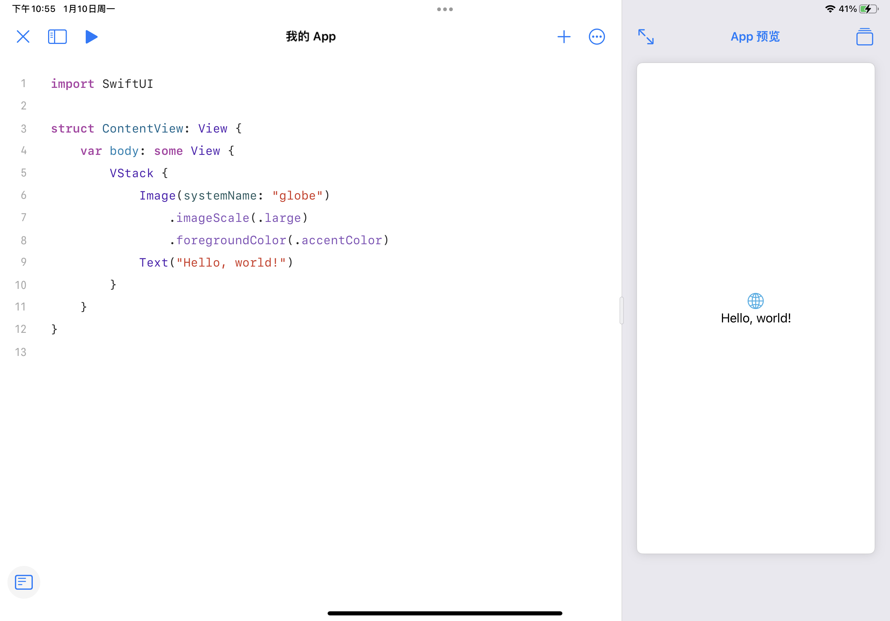

!!!info
    目前（2022 年 1 月）主流的 iOS 开发使用 Xcode 项目（Xcode project）进行，本文为了支持 iPadOS 平台并简化说明，使用最新的由 Swift Package Manager 管理的项目格式，此格式在 13.2 以上版本的 Xcode 上同样支持。实际开发时建议使用更加完善的 Xcode projcet。

## 创建项目

**Swift Playgrounds（iPad）**

在 Swift Playgrounds（4.0 以上版本）中，选择底部的 `App`。

**Xcode Swift Playground App**

在 Xcode（13.2 以上版本）中，选择 `File > New > Project` 中的 `Swift Playground App`。

**Xcode Project**

传统的 Xcode project，部分内容与 Swift Playground App 不同。

打开 Xcode，点击 `Create a new Xcode project`，选择 `iOS` 栏下的 `App`。在项目的配置界面，配置：

- Product Name：应用名称
- Team：开发使用的 Apple ID，可以为 `None`
- Organization Identifier：一个逆序的 DNS 名，如果不考虑上架可以任意
- Interface：选择 `SwiftUI`
- Language：`Swift`
- Use Core Data 和 Include Tests：本教程不涉及，可以不选

其余步骤按照默认配置即可。

## Hello, world!

使用 Swift Playgrounds 创建项目并进入后，可以看到左侧的源代码和右侧的实时预览：



实时预览是真实运行的 app，可以很方便地进行开发、调试。

打开侧边栏，可以浏览项目文件目录：


这两个文件，就是一个完整的可运行的 Hello World 程序。`MyApp.swift` 中的内容在本教程中不涉及，可以参考[后续拓展](./extensions.md)中的“SwiftUI 生命周期”。

## 深入 Hello World

接下来，我们通过这个 Hello World 程序，快速地介绍 SwiftUI 构建 UI 的基本概念，以及与 SwiftUI 有关的一些 Swift 语法。

这是我们之前看到的 `ContentView.swift`：

```swift
import SwiftUI

struct ContentView: View {
    var body: some View {
        VStack {
            Image(systemName: "globe")
                .imageScale(.large)
                .foregroundColor(.accentColor)
            Text("Hello, world!")
        }
    }
}
```

因为要用到 `SwiftUI` 框架，在文件的开头需要 `import SwiftUI`，之后 SwiftUI 中所有的符号均可直接使用。

在我们的 App 中，上面的 `ContentView` 是唯一的 View（在 `MyApp.swift` 中可以看到这一点），其 View 由垂直排列（`VStack`）的两个 View（`Image` 和 `Text`）构成。如果你点击运行，App 的所有内容就是 `ContentView`。

**在 SwiftUI 中，所有 UI，无论是一整个页面，还是单独的组件，都是一个 View。我们通过组合不同的 View 来构建 UI。**定义一个 View 需要：

- 定义一个遵循 `View` 协议的 `struct`
- 在 `struct` 定义一个名称为 `body`，类型为 `some View` 的计算变量（`View` 协议的规定）

**我们要做的，就是在 `body` 中描述我们的 UI。**我们将在下一节展开如何构建 UI 的话题，我们先关注其中的语法。

### `body` 的类型：`some View`

```swift hl_lines="2"
struct ContentView: View {
    var body: some View {
        VStack {
            Image(systemName: "globe")
                .imageScale(.large)
                .foregroundColor(.accentColor)
            Text("Hello, world!")
        }
    }
}
```

`body` 是一个类型为 `some View` 的计算变量。`some` 的含义是：**“这个类型遵循 `View` 这个协议，但我不方便写出这个类型，需要编译器来确定它的类型”**。也就是说，`body` 实际上是有一个确定的类型的，只不过我们不显式地写出来。这是一种叫做 [opaque return type](https://docs.swift.org/swift-book/LanguageGuide/OpaqueTypes.html) 的语法。

{>>你可以在下文中的《body 的具体类型》看到为什么“不方便写出这个类型”<<}

这也告诉我们，我们定义 View，实际上就是是返回另一个 View。**你没有办法在不利用已有 View 的情况下凭空生成一个 View。**

???note "关于 `View` 中的 `associatedtype`"
    `View` 的定义中有一个遵循 `View`、名为 `Body` 的 [`associatedtype`](https://docs.swift.org/swift-book/LanguageGuide/Generics.html#ID189)，并且 `body` 的类型实际上就是这个 `Body`：

    ```swift
    protocol View {
        associatedtype Body: View
        @ViewBuilder var body: Body { get }
    }
    ```

    注意到我们没有显式地指出 `Body`。实际上，`Body` 是这样确定的：

    1. 编译器根据 `body` 的表达式推断出 `body` 的类型（某个遵循 `View` 协议的具体类型）
    2. 因为 `body` 的类型是 `Body`，那么推断出 `Body` 就是在 1 中推断出的类型

    你可以从中看到 `some` 不可或缺的作用。

???note "为什么不能以 `View` 作为类型"
    如果你把 `some View` 改成 `View`，会出现编译错误：

    ```
    Protocol 'View' can only be used as a generic constraint because it has Self or associated type requirements
    ```

    `protocol` 在有 `associatedtype` 限制时不能够作为类型。因此，我们需要提供一个确定的、遵循 `View` 的类型。

### View modifier：修饰 View

```swift hl_lines="5-6"
struct ContentView: View {
    var body: some View {
        VStack {
            Image(systemName: "globe")
                .imageScale(.large)
                .foregroundColor(.accentColor)
            Text("Hello, world!")
        }
    }
}
```

单独的两行 `.imageScale(.large)` 和 `.foregroundColor(.accentColor)` 看起来很奇怪，实际上很好理解。`Image` 遵循 `View`，而 `imageScale` 和 `foregroundColor` 是 `View` 的成员函数，原来的代码相当于：

```swift
Image(systemName: "globe").imageScale(.large).foregroundColor(.accentColor)
```

打开文档，查看 `.imageScale(_:)` 的函数签名：

```swift
/// Scales images within the view according to one of
/// the relative sizes available including small, medium,
/// and large images sizes.
func imageScale(_ scale: Image.Scale) -> some View
```

我们可以看到，函数的返回值是 `some View`。也就是说，我们将原来的 View（即 `Image`）转换为了另一个 View，这个 View 的图标大小设置为 `.large`。

这种函数叫做 **view modifier**，也就是向原来的 View 进行一定的修饰，然后返回修饰后的 View。

这实际上是一种函数式编程。它的好处是显而易见的，比如，如上面的例子，我们可以给一个 View 连续添加 modifier：

```swift
Image(systemName: "globe")
    .imageScale(.large)
    .foregroundColor(.accentColor)
```

每次添加 modifier，这个表达式的类型依然是某种 `View`，而形式上看上去就像是不断给 `Image` 加上不同的样式一样。

???note "查看文档的几种方式"
    - Swift Playgrounds
        - 点击导航栏的 `(...) > 文档`，可以浏览所有文档
        - 在任意符号上（变量、函数、类型、协议等）鼠标右键点击（或触摸点击），选择 `帮助`，可以快速查看该符号相关文档
    - Xcode
        - 按 ++cmd+shift+0++ 可以打开并浏览所有的开发者文档。
        - 在任意符号上，按住 ++option++ 并点击该符号，可以快速查看文档
    - 网页版文档：https://developer.apple.com/documentation/technologies

???note "关于 View Modifier 与 `View` 的值类型"
    `struct` 是值类型，每次添加 modifier 都会生成一个新的副本，并不会改变原来的 View。例如：

    ```swift
    let view1 = Text("Hello")
    let view2 = view1.padding()
    ```

    `view1` 并不会添加 padding。Modifier 是完全没有副作用的。

???note "`body` 的具体类型"
    值得注意的是，每次添加 modifier，`body` 的实际类型都会发生改变：

    ```swift
    // Image
    Image(systemName: "globe")

    // ModifiedContent<Image, _EnvironmentKeyWritingModifier<Scale>>
    Image(systemName: "globe")
        .imageScale(.large)

    //ModifiedContent<
    //  ModifiedContent<Image, _EnvironmentKeyWritingModifier<Scale>>,
    //  _EnvironmentKeyWritingModifier<Optional<Color>>
    //>
    Image(systemName: "globe")
        .imageScale(.large)
        .foregroundColor(.accentColor)
    ```

    这里 `_EnvironmentKeyWritingModifier` 是 SwiftUI 内置的私有类型，对外不可见。容易指出，`ModifiedContent` 遵循 `View`。

    ???note "如何查看 View 的类型"
        你可以用 Swift 的命令行工具进行快速的实验：

        ```swift
        liang2kl@liang2kl ~> swift

          1> import SwiftUI
          2> Image(systemName: "globe").imageScale(.large)
        $R0: some View = ModifiedContent<Image, _EnvironmentKeyWritingModifier<Scale>>...
        ```

        某些版本的命令行工具并不能正确显示类型，如：

        ```swift
        $R0: some View = <extracting data from value failed>
        ```

        你可以使用 `String(describing:)` 来查看：

        ```swift
          3> String(describing: $R0)
        $R1: String = "ModifiedContent<Image, _EnvironmentKeyWritingModifier<Scale>>..."
        ```

    这就解释了为什么我们为什么需要写 `some View`，而不是直接给出最后的类型。`body` 实际的类型往往非常复杂：一个 View 可能是由另外一个或多个 View 通过某种方式构成的，而且这种构成往往使用模版完成，正如 `ModifiedContent<Image, _EnvironmentKeyWritingModifier<Scale>>` 显示的那样。

    而且，在我们组建 View 的时候，我们写的 View 的类型是不断变化的，我们不可能随着我们写代码而不断变化的 View 而不断地修改类型。这件事交由编译器完成再合适不过——Swift 具有自动类型推断，编译器根据 `var body` 中的表达式就可以确定 `body` 的类型。

    当然，你不必对这个话题过于费心，你只需要保证 `body` 中返回的是一个 View 即可，剩下的工作就交给编译器吧。

### HTML？

```swift hl_lines="4-7"
struct ContentView: View {
    var body: some View {
        VStack {
            Image(systemName: "globe")
                .imageScale(.large)
                .foregroundColor(.accentColor)
            Text("Hello, world!")
        }
    }
}
```

Hello World 程序中还有一个令人迷惑的地方：`VStack` 的构造函数中的内容看上去就像 HTML 一样，结构非常直观，但并不像是一般的 Swift 语言。实际上，这的确是类型安全、静态类型的 Swift 语言，而且这种语法就是为了 SwiftUI 而设计的。这个问题，我们留到[构建 View](./build-views.md)中介绍。
