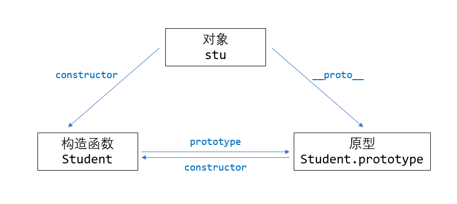
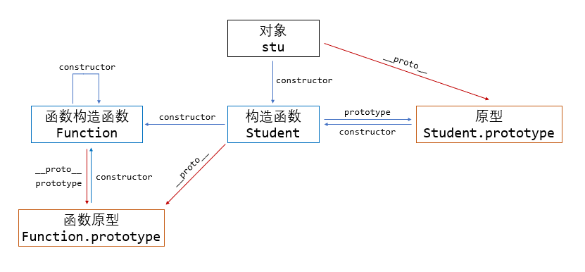
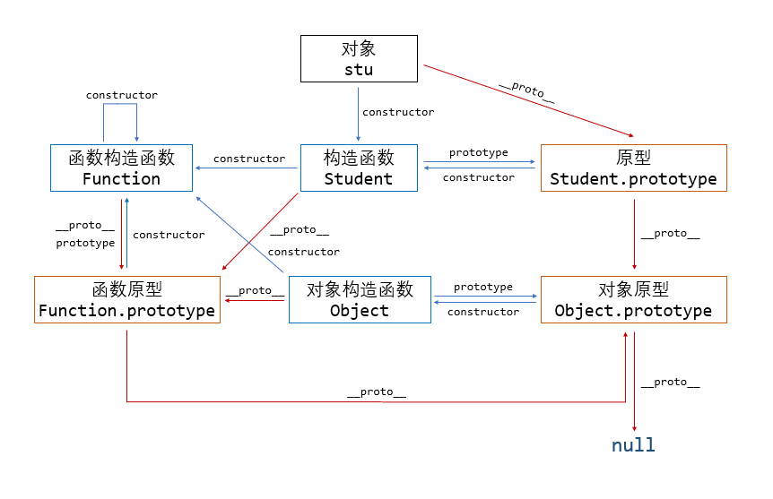

## JavaScript 的面向对象进阶

!!! note "一些可能不必要的知识"

    本章节将主要讲解 JavaScript 面向对象编程的原型链逻辑，但这些知识对于 JavaScript 的初学者并不一定必要。所以编者建议如果只是想学习 JavaScript 基础语法后直接转 TypeScript 以及上手前端框架，则不需要浪费时间学习这一部分。想要深入了解这一门语言的读者，编者建议一定要学习这一部分。

### JavaScript 的第一原则

这里，让我们首先铭记这样的一句话：

<center>函数是 JavaScript 的一等公民，对象由函数创建。</center>

或许我们常见的创建对象的方式是：

```javascript
let a = {
    foo: 1,
    bar: "foobar",
};

let b = [1, 2, 3];
```

但这只是方便编程的语法糖，我们这里希望使用下述更为本质的创建方式：

```javascript
let a = new Object();
a.foo = 1;
a.bar = "foobar";

let b = new Array();
b[0] = 1;
b[1] = 2;
b[2] = 3;
```

而这里 `Object` 和 `Array` 是两个函数，一定程度上可以理解为构造函数：

```javascript
typeof Object; // function
typeof Array; // function
```

### 原型和构造函数

我们说过对象都是函数构造的，所以我们就从构造函数出发讲解 JavaScript 的面向对象。

构造函数的作用是构建一个新对象，比如说我们可以写一个根据传入参数构造具有一种特定形式的对象的函数：

```javascript
function createStudent(_name, _age) {
    let res = {};
    res.name = _name;
    res.age = _age;
    return res;
}

let stu = createStudent("Ashitemaru", 22);
```

这个函数就可以接受一个学生的名字和年龄，构造出一个包含这两个信息的、描述这个学生的对象并返回。这类需求，即根据信息构造指定形式对象的需求是很常见的，所以 JavaScript 就提供了语法上的支持以将其与普通函数区分开。比如上述函数就可以写为：

```javascript
function Student(_name, _age) {
    this.name = _name;
    this.age = _age;
}

let stu = new Student("Ashitemaru", 22);
```

这里使用 `new` 关键字调用构造函数，这种调用方式就区分了构造函数和普通函数。并且，构造函数内部不用我们再自己构造一个空对象，而是直接使用 `this` 对象，并且在使用 `new` 调用的时候，函数会自动将 `this` 返回。实际上，如果不用 `new` 关键字调用构造函数也是合法的，这样的话该函数将会作为普通函数执行并返回 `undefined`。

!!! caution "可能的语法缺陷"

    如果我们不使用 `new` 关键字调用上述构造函数，根据先前的知识，这里 `this` 就会指向全局对象，从而语句 `this.name = _name` 将会构造出一个新的全局对象：

    ```javascript
    function Student(_name, _age) {
        this.name = _name;
        this.age = _age;
    }

    let stu = Student("Ashitemaru", 22);

    stu; // undefined
    name; // Ashitemaru
    ```

    这是一种危险的行为，因为其可以污染全局作用域。

    目前大部分代码检查工具都会要求构造函数名称首字母大写以示区分，基于此，会强制检查构造函数是否使用 `new` 关键字调用。

!!! note "所有函数都可以是构造函数"

    实际上一般函数也可以用 `new` 调用，其也会触发一次对象生成并返回生成的对象。而由于 `new` 关键字调用会让函数强行返回 `this` 对象从而覆盖掉原定义的返回值，但是由于一般函数内部一般不会设定 `this` 对象的属性，所以使用 `new` 关键字调用一般函数一般会得到一个空对象：

    ```javascript
    function sum(x, y) {
        return x + y;
    }

    let num = sum(1, 2); // 3
    let obj = new sum(1, 2); // {}
    ```

现在我们回退一步，思考一下面向对象的意义。面向对象编程的一个重要的思维出发点是将具有类似抽象特征的事物归纳为一个**类**，根据一个定义好的类，可以创建这个类的对象，这个对象会满足类定义的所有要求。最初的 JavaScript 语言并没有类的概念，其践行面向对象思维的方式是采用**原型**。

原型的含义就是作为原型的这个对象所衍生出来的各个对象都与之有联系，满足原型要求的约束。我们又说过所有的对象都是通过函数生成，不妨让所有函数都具有一个 `prototype` 属性指向一个原型对象 `obj`，用这个函数构造出来的所有对象都以 `obj` 为原型，满足其约束。

比如说“学生都应当学习”，我们希望所有通过 `Student` 函数构造出来的对象都有 `study()` 方法。除去在构造函数中这样定义：

```javascript
function Student(_name, _age) {
    this.name = _name;
    this.age = _age;

    this.study = () => {
        console.log("studying...");
    };
}
```

我们还可以在 `Student` 的 `prototype` 属性下定义：

```javascript
Student.prototype.study = () => {
    console.log("studying...");
};
```

在执行 `const stu = new Student("Ashitemaru", 22)` 时，实际上相当于：

```javascript
const stu = new Object();
stu.__proto__ = Student.prototype;
Student.call(stu, "Ashitemaru", 22);
```

!!! note "内置对象的原型"
    
    之前我们讲到内置对象时虽然提到构造的对象可以访问原型的方法，但没有解释这些对象的原型到底是什么，到这里我们可以明白，以 `Object` 函数构造的的对象，其原型就是 `Object.prototype`。特别地，`Object.prototype` 的原型是 null。

这样，通过 `Student` 函数构造出来的对象就以 `Student.prototype` 为原型，因此可以调用 `study` 方法：

```javascript
function Student(_name, _age) {
    this.name = _name;
    this.age = _age;
}
Student.prototype.study = () => {
    console.log("studying...");
};

let stu = new Student("Ashitemaru", 22);
stu.study(); // studying...
```

我们可以运行下述代码确定 `stu` 是以 `Student.prototype` 为原型构造出来的对象：

```javascript
stu.__proto__ === Student.prototype; // true
```

`__proto__` 属性是所有对象都具有的，其指向这个对象的原型，也就是这个对象构造函数 `prototype` 所指向的对象。

!!! caution "废弃警告"

    `__proto__` 是即将废弃的属性，并且和 Python 类似，其名称使用双下划线包围实际上就代表了其理应私有，不能直接访问。

另外，这里介绍 `constructor` 属性。所有对象都具有这个属性，其指向这个对象的构造函数：

```javascript
stu.constructor === Student; // true
```

并且由于原型也可以认为是通过构造函数构造，所以：

```javascript
Student.prototype.constructor === Student; // true
```

这样的三角关系可以总结为：



---

现在我们就可以介绍 ES6 的类语法糖到底是怎么一回事了：

```javascript
class Student {
    constructor(_name, _age) {
        this.name = _name;
        this.age = _age;
    }

    study() {
        console.log("studying...");
    }
}
```

其实际上是下述代码（一种可能）：

```javascript
var Student = /** @class */ (function () {
    function Student(_name, _age) {
        this.name = _name;
        this.age = _age;
    }
    Student.prototype.study = function () {
        console.log("studying...");
    }

    return Student;
}());
```

可以看见，ES6 的类中定义的类方法就会被挂载到构造函数的 `prototype` 属性下。这里尤其注意闭包的使用，这样才能保证作用域正确。

### 函数的原型

上面我们都是使用的自定义构造函数讲解的原型，那么函数也是对象，他们都应该有原型。

JavaScript 的函数的包装类为 `Function`，`Function` 是函数的构造函数，所以实际上声明函数还有一种写法：

```javascript
const sum = new Function("x", "y", "return x + y");
sum(1, 2); // 3
```

但显然不推荐这样写。

按照一个对象的 `__proto__` 指向其构造函数 `prototype` 的原则，显然有：

```javascript
function foo() { }

foo.__proto__ === Function.prototype; // true
```

而显然，所有构造函数也是函数：

```javascript
Object.__proto__ === Function.prototype; // true
Function.__proto__ === Function.prototype; // true
```

这里就会出现这样的环状引用，即 `Function.__proto__ === Function.prototype`。

另外，`Function` 是所有函数的构造函数，所以显然有：

```javascript
function foo() { }

foo.constructor === Function; // true
Function.constructor === Function; // true
```

现在我们可以将这些关系记录下来，这里我们将 `__proto__` 的指向使用红色箭头，这么做的原因后续讲解。同时，我们将一般对象、原型、构造函数的外框颜色作出区分，后续我们也将沿用这一配色：



### 原型的原型

上面讨论函数的原型，但是还有一个问题没有解决，那就是原型也是对象，那么原型的原型是什么？

JavaScript 认为所有的原型均是由 `Object` 直接产生的，也就是说和 `new Object()` 创建出来的无异，只不过后续增添若干属性。在这样的设计思想下，所有原型的 `__proto__` 均指向 `Object.prototype`。但有个例外，`Object.prototype` 也是原型，但是其 `__proto__` 指向 `null`。也就是说：



这种关系看起来复杂，但实际上核心就是找三元组，即对象、构造函数和原型的关系。复杂的原因只不过是函数也是对象，原型也是对象而已。

!!! note

    遵循 ECMAScript 标准，`someObject.[[Prototype]]` 符号是用于指向 `someObject` 的原型。从 ECMAScript 6 开始，`[[Prototype]]` 可以通过 `Object.getPrototypeOf()` 和 `Object.setPrototypeOf()` 访问器来访问。这个等同于 JavaScript 的非标准但许多浏览器实现的属性 `__proto__`。

### 继承

#### 原型链继承

我们所说的**原型链**，就是由 `__proto__` 关系串联起的一条链，比如说 `stu --> Student.prototype --> Object.prototype --> null` 就是一条完整的原型链。

当我们访问某一个对象的属性的时候，JavaScript 引擎搜索该属性的顺序是，首先寻找该对象本身是否具有该属性，若没有则沿着原型链上升一级，在上升后的对象里继续寻找，若没有找到则继续上升，直到上升到 `null`。

这里演示当尝试访问属性时会发生什么：

```javascript
// 让我们从一个函数里创建一个对象 o，它自身拥有属性 a 和 b 的：
function f() {
    this.a = 1;
    this.b = 2;
}
let o = new f(); // {a: 1, b: 2}

// 在 f 函数的原型上定义属性
f.prototype.b = 3;
f.prototype.c = 4;

// 不要在 f 函数的原型上直接定义 f.prototype = {b:3,c:4};这样会直接打破原型链
// o.[[Prototype]] 有属性 b 和 c
//  (其实就是 o.__proto__ 或者 o.constructor.prototype)
// o.[[Prototype]].[[Prototype]] 是 Object.prototype.
// 最后 o.[[Prototype]].[[Prototype]].[[Prototype]] 是 null
// 这就是原型链的末尾，即 null，
// 根据定义，null 就是没有 [[Prototype]]。

// 综上，整个原型链如下：

// {a:1, b:2} ---> {b:3, c:4} ---> Object.prototype---> null

console.log(o.a); // 1
// a 是 o 的自身属性吗？是的，该属性的值为 1

console.log(o.b); // 2
// b 是 o 的自身属性吗？是的，该属性的值为 2
// 原型上也有一个'b'属性，但是它不会被访问到。
// 这种情况被称为"属性遮蔽 (property shadowing)"

console.log(o.c); // 4
// c 是 o 的自身属性吗？不是，那看看它的原型上有没有
// c 是 o.[[Prototype]] 的属性吗？是的，该属性的值为 4

console.log(o.d); // undefined
// d 是 o 的自身属性吗？不是，那看看它的原型上有没有
// d 是 o.[[Prototype]] 的属性吗？不是，那看看它的原型上有没有
// o.[[Prototype]].[[Prototype]] 为 null，停止搜索
// 找不到 d 属性，返回 undefined
```

JavaScript 并没有其他基于类的语言所定义的“方法”。在 JavaScript 里，任何函数都可以添加到对象上作为对象的属性。函数的继承与其他的属性继承没有差别，包括上面的“属性遮蔽”（这种情况相当于其他语言的方法重写）。

当继承的函数被调用时，`this` 指向的是当前继承的对象，而不是继承的函数所在的原型对象。

我们知道 `Object.prototype` 之中具有方法 `toString()`，所以只要某个对象的原型链上有 `Object.prototype`，则可以在这个对象上调用 `toString()`：

```javascript
function Student(_name, _age) {
    this.name = _name;
    this.age = _age;
}
Student.prototype.study = () => {
    console.log("studying...");
};

let stu = new Student("Ashitemaru", 22);
stu.toString(); // '[object Object]'
```

---

现在我们考虑怎么在原型链语法之下实现继承。继承的目标是给定一个基类以规定所有派生类需要满足的所有条件，派生类可以复用基类定义的类方法，也可以覆写基类方法实现多态。这里使用的例子中 `Student` 和 `Person` 类分别定义为：

```javascript
let Person = /** @class */ (function () {
    function Person(_name, _age) {
        this.name = _name;
        this.age = _age;
    }
    Person.prototype.walk = function () {
        console.log("walking...");
    }

    return Person;
}());

let Student = /** @class */ (function () {
    function Student(_school) {
        this.school = _school;
    }
    Student.prototype.study = function () {
        console.log("studying...");
    }

    return Student;
}());
```

我们要求 `Student` 作为基类 `Person` 的派生类。并且根据以上的叙述，JavaScript 的类和构造函数是近乎等价的概念。

如果我们要求 `Student` 类对象能够使用 `Person` 之中定义的方法，考虑到 `Person` 之中定义的方法显然不会在 `Student` 类对象之中，所以**`Person` 类对象必然要位于 `Student` 类对象的原型链上**。比如说 `per` 是 `Person` 类的对象，我们可以尝试这样构建原型链：

```text
// before
stu --> Student.prototype --> Object.prototype --> null

// after
stu --> Student.prototype(per) --> Person.prototype --> Object.prototype --> null
```

那这样我们做这样的尝试：

```javascript
let Person = /** @class */ (function () {
    function Person(_name, _age) {
        this.name = _name;
        this.age = _age;

        this.val = [1]; // Only for display
    }
    Person.prototype.walk = function () {
        console.log("walking...");
    }

    return Person;
}());

let Student = /** @class */ (function () {
    function Student(_school) {
        this.school = _school;
    }
    
    let per = new Person("Ashitemaru", 22);
    Student.prototype = per; // Reset prototype

    Student.prototype.study = function () {
        console.log("studying...");
    }

    return Student;
}());

let stu = new Student("Tsinghua");
stu.walk(); // walking...
stu.study(); // studying...
console.log(stu.name, stu.school, stu.age); // Ashitemaru Tsinghua 22
```

这个方法很直观且可理解，基类的方法也得到了复用。但是问题也很大，主要有二。

首先我们注意到我们在创建基类对象赋予给派生类的 `prototype` 的时候是无法自定义传给基类构造函数的参数的，上述例子之中只能写死。

另外，观察：

```javascript
let stu1 = new Student("Tsinghua");
let stu2 = new Student("Peking");

stu1.val.push(2);
console.log(stu2.val); // [1, 2]
```

也就是说如果基类成员有数组等非基本类型的变量，则很有可能导致意外的修改。所有派生类的对象共享了该基类成员的引用，所以只要任意一个派生类对象修改了该基类成员，就会导致在其他派生类成员对象视角下的意外修改。

#### 借用构造继承

我们刚刚从原型链的角度思考了如何将基类的方法和成员让派生类成员访问到，最后我们选择的方式是修改原型链。但是我们可以直接将这些方法和成员直接挂载到派生类成员上，只需要调用基类构造函数并且强制指定此时的 `this` 指向的是派生类的对象而非基类对象。

这个继承方法的实质就是借用了基类的构造函数为派生类构造方法和成员。

```javascript
let Person = /** @class */ (function () {
    function Person(_name, _age) {
        this.name = _name;
        this.age = _age;

        this.val = [1]; // Only for display

        this.walk = function () {
            console.log("walking...");
        } // Must define class methods inside the constructor
          // instead of defining them in prototype
    }
    Person.prototype.run = function() {
        console.log("running...");
    }

    return Person;
}());

let Student = /** @class */ (function () {
    function Student(_name, _age, _school) {
        Person.call(this, _name, _age);
        this.school = _school;
    }
    Student.prototype.study = function () {
        console.log("studying...");
    }

    return Student;
}());

let stu = new Student("Ashitemaru", 22, "Tsinghua");
stu.walk(); // walking...
stu.study(); // studying...
console.log(stu.name, stu.school, stu.age); // Ashitemaru Tsinghua 22
```

这里一定要注意，基类的类方法不能挂载在 `prototype` 之下，因为在派生类构造函数中我们不会使用 `new` 关键字调用基类构造函数，其在原型下挂载的方法并不会挂载到 `this` 对象之下。这也是这个方法的缺陷：

```javascript
let stu = new Student("Ashitemaru", 22, "Tsinghua");
stu.run; // undefined
```

这个时候我们解决了不能给基类构造函数传参数的问题，并且多个派生类对象此时并不会共享数组的引用，所以不会发生意外修改：

```javascript
let stu1 = new Student("Ashitemaru", 22, "Tsinghua");
let stu2 = new Student("SmileLee", 22, "Peking");

stu1.val.push(2);
console.log(stu2.val); // [1]
```

但是这也意味着资源浪费，因为类方法的引用是可以共享而不用每个对象都保留副本的：

```javascript
stu1.walk === stu2.walk; // false
```

#### 组合继承

显然我们介绍的两个方法是互补的，一边的缺陷可以由另一边解决，所以我们可以同时使用这两种方法：

```javascript
let Person = /** @class */ (function () {
    function Person(_name, _age) {
        this.name = _name;
        this.age = _age;

        this.val = [1]; // Only for display
    } // Keep unshareable variables in constructor
    Person.prototype.walk = function () {
        console.log("walking...");
    } // Keep shareable variables in prototype

    return Person;
}());

let Student = /** @class */ (function () {
    function Student(_name, _age, _school) {
        Person.call(this, _name, _age);
        this.school = _school;
    }
    
    let per = new Person();
    Student.prototype = per; // Reset prototype

    Student.prototype.study = function () {
        console.log("studying...");
    }

    return Student;
}());

let stu = new Student("Ashitemaru", 22, "Tsinghua");
stu.walk(); // walking...
stu.study(); // studying...
console.log(stu.name, stu.school, stu.age); // Ashitemaru Tsinghua 22
```

这里我们只需要将不能共享的成员或者方法写在基类构造函数中，这样这些方法就会因为构造函数借用被挂载到派生类对象本身上，从而不会共享。而需要共享的类方法则可以挂载在原型上，直接通过原型链实现共享。

可以发现问题确实解决了：

```javascript
let stu1 = new Student("Ashitemaru", 22, "Tsinghua");
let stu2 = new Student("SmileLee", 22, "Peking");

stu1.val.push(2);
console.log(stu2.val); // [1]

stu1.walk === stu2.walk; // true
stu1.walk === undefined; // false
```

#### 寄生组合继承

上述继承的实现实际上还有一点点效率问题，即基类构造函数调用了两次。第一次是 `Person.call()`，第二次是 `new Person()`。可以注意到这两次调用分别做了不同的事情，分别是将非共享属性挂载到派生类对象上和修改派生类原型链以共享可共享属性。如果基类十分庞大，这可能会导致较大的效率问题。

但实际上第二次调用可以省略。现在思考如何省略，由于这次调用的目的是修改原型链，所以不妨观察一下我们修改原型链的思路：

```text
// before
stu --> Student.prototype --> Object.prototype --> null

// after
stu --> Student.prototype(per) --> Person.prototype --> Object.prototype --> null
```

事实上我们完全可以不用构造一个完整的 `Person` 对象 `per`，我们完全可以用一个空对象 `o` 来完成这个任务。即，我们将 `Student.prototype` 指向一个空对象 `o`，再想办法让 `o` 的 `__proto__` 指向 `Person.prototype` 即可。

这样，我们用多设定一次原型链指向（由于 `per` 的 `__proto__` 默认指向 `Person.prototype` 而空对象则不是）替换掉了多调用一次基类构造函数，这样是完全值得的。

代码可以是：

```javascript hl_lines="21 22 23 24"
let Person = /** @class */ (function () {
    function Person(_name, _age) {
        this.name = _name;
        this.age = _age;

        this.val = [1]; // Only for display
    }
    Person.prototype.walk = function () {
        console.log("walking...");
    }

    return Person;
}());

let Student = /** @class */ (function () {
    function Student(_name, _age, _school) {
        Person.call(this, _name, _age);
        this.school = _school;
    }

    function F() { }
    F.prototype = Person.prototype;
    Student.prototype = new F();
    Student.prototype.constructor = Student;

    Student.prototype.study = function () {
        console.log("studying...");
    }

    return Student;
}());
```

这里的核心就是代码的高亮部分，其中最核心的就是注意要修复原型的构造函数，因为修复前原型的构造函数将会是 `F`。

由于这种继承的实现方式已经较为高效且容易理解，所以目前 ES6 的 `extends` 也是基于此而来。

### 创建对象和生成原型链

除了之前已经提到过的语法外，还可以通过以下方式创建对象并指定其原型（从而扩展原型链）。

#### 使用构造器创建的对象

前面已经提到，在 JavaScript 中，构造器其实就是一个普通的函数。当使用 `new` 操作符来作用这个函数时，它就可以被称为构造方法（构造函数）。

```javascript
function Graph() {
    this.vertices = [];
    this.edges = [];
}

Graph.prototype = {
    addVertex: function(v) {
        this.vertices.push(v);
    }
};

const g = new Graph();
// g 是生成的对象，他的自身属性有 'vertices' 和 'edges'。
// 在 g 被实例化时，g.[[Prototype]] 指向了 Graph.prototype。
```

这里有必要注意的是，通过指定 `Graph.prototype` 可以使得实例化的对象 `g` 获取原型上的方法，这里的原型是一个对象字面量，它的原型是 `Object.prototype`。

由于默认情况下函数的原型的原型就是 `Object.prototype`，上述定义也等价于：

```javascript
function Graph() {
    this.vertices = [];
    this.edges = [];
}

Graph.prototype.addVertex = function(v) {
    this.vertices.push(v);
}

const g = new Graph();
// g 是生成的对象，他的自身属性有 'vertices' 和 'edges'。
// 在 g 被实例化时，g.[[Prototype]] 指向了 Graph.prototype。
```

但指定原型时也可以指定其他对象，这就使得原型链变长，从而以此函数构造的对象可以访问更多的方法：

```javascript
function GraphInner(type) {
    this.type = type;
}
GraphInner.prototype.printType = function () {
    console.log(this.type);
}

function Graph() {
    this.vertices = [];
    this.edges = [];
}

Graph.prototype = new GraphInner('Sparse graph');

Graph.prototype.addVertex = function(v){
    this.vertices.push(v);
}

const g = new Graph();
g.printType();   // => Sparse graph
```

#### 使用 `Object.create` 创建对象

ECMAScript 5 中引入了一个新方法：`Object.create()`。可以调用这个方法来创建一个新对象。新对象的原型就是调用 `create` 方法时传入的第一个参数：

```javascript
var a = {a: 1};
// a ---> Object.prototype ---> null

var b = Object.create(a);
// b ---> a ---> Object.prototype ---> null
console.log(b.a); // 1 (继承而来)

var c = Object.create(b);
// c ---> b ---> a ---> Object.prototype ---> null

var d = Object.create(null);
// d ---> null
console.log(d.hasOwnProperty); // undefined，因为 d 没有继承 Object.prototype
```

注意其中的 `Object.create(null)` 方法，这种方法直接以 `null` 为原型创建对象，从而得到一个没有任何预设属性的对象，当 `Object` 的方法阻碍了你的代码运行时，这种方法可以避免，但请不要在其他情况下使用这种方法，这通常不是你所需要的。

#### 使用 `class` 关键字创建对象

使用 `extends` 关键字实现继承，本质上是指定原型的一种语法糖。使用 `super` 函数来调用父类的构造函数：

```javascript
class Polygon {
    constructor(height, width) {
        this.height = height;
        this.width = width;
    }
}

class Square extends Polygon {
    constructor(sideLength) {
        super(sideLength, sideLength);
    }
    get area() {
        return this.height * this.width;
    }
    set sideLength(newLength) {
        this.height = newLength;
        this.width = newLength;
    }
}

var square = new Square(2);
```

### 性能

在原型链上查找属性比较耗时，对性能有副作用，这在性能要求苛刻的情况下很重要。另外，试图访问不存在的属性时会遍历整个原型链。
